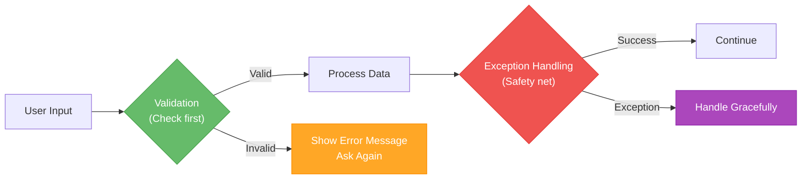
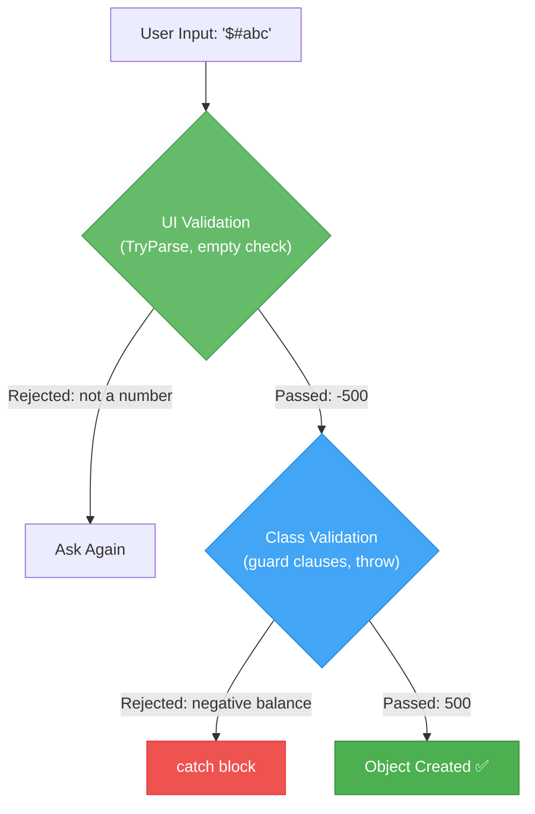
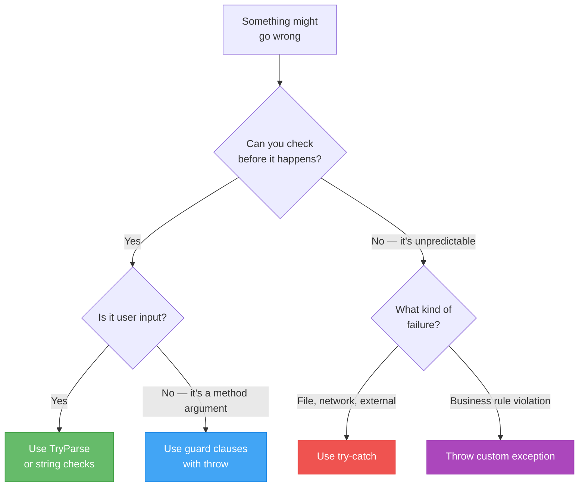

# Lecture 3: Defensive Programming and Validation Strategies

[← Previous: Lecture 2 – Throwing Exceptions and Custom Exception Classes](./lecture-2.md) | [Back to Week 12 Overview](./README.md)

---

## Lecture Overview

| Item | Detail |
|------|--------|
| Duration | 45 minutes |
| Topics | Validation vs exception handling, TryParse pattern, input validation strategies, `using` statement, best practices |
| Preparation | Comfortable with try-catch and throwing exceptions from Lectures 1–2 |

---

## 1. Two Lines of Defense

You now know two tools for dealing with errors: **validation** (checking before something goes wrong) and **exception handling** (catching errors after they happen). But when should you use which?



> **Analogy:** Validation is like checking the weather before leaving the house. Exception handling is like carrying an umbrella just in case. You should do both — but checking the weather first means you'll rarely need the umbrella.

### The Key Difference

| | Validation | Exception Handling |
|---|---|---|
| **When** | Before the operation | After something fails |
| **Purpose** | Prevent errors | Recover from errors |
| **Performance** | Fast (simple checks) | Slower (exception creation is expensive) |
| **Use for** | Expected bad input | Unexpected failures |
| **Example** | Checking if a string is empty | File suddenly deleted during read |

---

## 2. The TryParse Pattern — Validation Without Exceptions

Remember the retry loop from Lecture 1 that used `int.Parse` inside try-catch? There's a better way:

```csharp
// ❌ Using exceptions for expected invalid input
try
{
    int age = int.Parse(Console.ReadLine());
}
catch (FormatException)
{
    Console.WriteLine("Not a number.");
}

// ✅ Using TryParse — no exception needed
if (int.TryParse(Console.ReadLine(), out int age))
{
    Console.WriteLine($"Your age: {age}");
}
else
{
    Console.WriteLine("Not a number.");
}
```

### How TryParse Works

`TryParse` returns a `bool` — `true` if the conversion succeeded, `false` if it didn't. If successful, the converted value is placed in the `out` variable.

```csharp
string input = "42";
bool success = int.TryParse(input, out int result);
// success = true, result = 42

string bad = "hello";
bool fail = int.TryParse(bad, out int result2);
// fail = false, result2 = 0 (default)
```

All numeric types have `TryParse`:

| Type | TryParse |
|------|----------|
| `int` | `int.TryParse(input, out int result)` |
| `double` | `double.TryParse(input, out double result)` |
| `decimal` | `decimal.TryParse(input, out decimal result)` |
| `bool` | `bool.TryParse(input, out bool result)` |
| `DateTime` | `DateTime.TryParse(input, out DateTime result)` |

### Robust Input Method Using TryParse

```csharp
static int GetValidInt(string prompt, int min, int max)
{
    while (true)
    {
        Console.Write(prompt);
        string input = Console.ReadLine();

        if (!int.TryParse(input, out int result))
        {
            Console.WriteLine("Please enter a valid whole number.");
            continue;
        }

        if (result < min || result > max)
        {
            Console.WriteLine($"Please enter a number between {min} and {max}.");
            continue;
        }

        return result;
    }
}
```

**Usage:**
```csharp
int age = GetValidInt("Enter your age (0-150): ", 0, 150);
int quantity = GetValidInt("How many items? (1-100): ", 1, 100);
```

This is cleaner and faster than using try-catch — and it's the idiomatic C# approach.

---

## 3. Input Validation Patterns

Here are the most common validation patterns you'll use:

### String Validation

```csharp
static string GetNonEmptyString(string prompt)
{
    while (true)
    {
        Console.Write(prompt);
        string input = Console.ReadLine();

        if (string.IsNullOrWhiteSpace(input))
        {
            Console.WriteLine("Input cannot be empty.");
            continue;
        }

        return input.Trim();
    }
}
```

### Menu Selection

```csharp
static int GetMenuChoice(string[] options)
{
    for (int i = 0; i < options.Length; i++)
        Console.WriteLine($"  {i + 1}. {options[i]}");

    return GetValidInt("Your choice: ", 1, options.Length);
}
```

### Yes/No Confirmation

```csharp
static bool GetConfirmation(string prompt)
{
    while (true)
    {
        Console.Write($"{prompt} (y/n): ");
        string input = Console.ReadLine()?.Trim().ToLower();

        if (input == "y" || input == "yes") return true;
        if (input == "n" || input == "no") return false;

        Console.WriteLine("Please enter 'y' or 'n'.");
    }
}
```

> **Tip:** Build a small library of these validation methods. You'll reuse them in almost every console application.

---

## 4. Validation in Classes vs. at the UI Level

Validation should happen at **two levels**:

1. **UI level** — catch obviously bad input before it reaches your objects
2. **Class level** — enforce rules inside your classes as the last line of defense

```csharp
// UI Level — validates user input format
Console.Write("Enter account balance: ");
if (!decimal.TryParse(Console.ReadLine(), out decimal balance))
{
    Console.WriteLine("Please enter a valid number.");
    return;
}

// Class Level — validates business rules
// (This still throws if balance is negative, even if UI validation is bypassed)
try
{
    BankAccount account = new BankAccount("Alice", balance);
}
catch (ArgumentOutOfRangeException ex)
{
    Console.WriteLine($"Invalid balance: {ex.Message}");
}
```



> **Why validate in both places?** Because your class might be used by other code in the future — not just your console program. The class should protect itself regardless of who's calling it. This is encapsulation in action (Week 8).

---

## 5. When to Use What — Decision Guide



### Quick Reference

| Situation | Approach |
|-----------|----------|
| User types "abc" instead of a number | `TryParse` (validation) |
| Method receives a null argument | `throw new ArgumentNullException` (guard clause) |
| File might not exist | `try-catch` with `FileNotFoundException` |
| Account balance would go negative | `throw new InsufficientFundsException` (business rule) |
| Checking if a list is empty before accessing first element | `if (list.Count > 0)` (validation) |
| Database connection drops mid-operation | `try-catch` (unpredictable failure) |

---

## 6. The using Statement — Automatic Cleanup

When you work with **resources** like files, database connections, or network connections, you need to make sure they get closed — even if an exception occurs. The `using` statement handles this automatically:

```csharp
// WITHOUT using — you must remember to close the file
StreamWriter writer = new StreamWriter("output.txt");
try
{
    writer.WriteLine("Hello, World!");
}
finally
{
    writer.Close();  // Must close even if exception occurs
}

// WITH using — automatic cleanup
using (StreamWriter writer = new StreamWriter("output.txt"))
{
    writer.WriteLine("Hello, World!");
}  // writer.Close() is called automatically here, even if an exception occurs
```

### Modern Syntax (C# 8+)

```csharp
// Even simpler — the resource is disposed when the variable goes out of scope
using StreamWriter writer = new StreamWriter("output.txt");
writer.WriteLine("Hello, World!");
// writer is automatically closed at the end of the method/block
```

### Reading a File Safely

```csharp
static string ReadFileSafely(string path)
{
    try
    {
        using StreamReader reader = new StreamReader(path);
        return reader.ReadToEnd();
    }
    catch (FileNotFoundException)
    {
        Console.WriteLine($"File not found: {path}");
        return string.Empty;
    }
    catch (IOException ex)
    {
        Console.WriteLine($"Error reading file: {ex.Message}");
        return string.Empty;
    }
}
```

> **Key concept:** `using` works with any class that implements `IDisposable` (an interface — remember Week 11). You don't need to memorize which classes need `using` right now. Just know that **file and database operations** are the main ones. You'll use this extensively in the Web App course with Entity Framework.

---

## 7. Best Practices Summary

### ✅ Do

1. **Validate user input** with `TryParse` and string checks — don't use exceptions for expected bad input
2. **Use guard clauses** at the top of methods to validate parameters
3. **Throw specific exception types** that match the problem
4. **Create custom exceptions** when built-in types aren't descriptive enough
5. **Catch specific exceptions** — know what you're handling
6. **Use `using`** for files, streams, and database connections
7. **Provide helpful error messages** — tell the user what went wrong and how to fix it

### ❌ Don't

1. **Don't swallow exceptions** — empty catch blocks hide bugs
2. **Don't use exceptions for flow control** — they're expensive and confusing
3. **Don't catch `Exception`** everywhere — be specific
4. **Don't ignore the exception hierarchy** — catch specific before general
5. **Don't put your entire program in one big try-catch** — catch close to where you can handle it

---

## 8. Complete Example — Robust Student Registration

Let's bring everything together in a realistic program:

```csharp
// Custom exception
public class DuplicateStudentException : Exception
{
    public string StudentId { get; }

    public DuplicateStudentException(string studentId)
        : base($"Student with ID '{studentId}' already exists.")
    {
        StudentId = studentId;
    }
}

// Student class with validation
public class Student
{
    public string Id { get; }
    public string Name { get; }
    public int Age { get; }

    public Student(string id, string name, int age)
    {
        if (string.IsNullOrWhiteSpace(id))
            throw new ArgumentException("Student ID is required.", nameof(id));
        if (string.IsNullOrWhiteSpace(name))
            throw new ArgumentException("Name is required.", nameof(name));
        if (age < 16 || age > 100)
            throw new ArgumentOutOfRangeException(nameof(age), "Age must be between 16 and 100.");

        Id = id.Trim().ToUpper();
        Name = name.Trim();
        Age = age;
    }

    public override string ToString()
    {
        return $"[{Id}] {Name}, Age: {Age}";
    }
}

// Registry class with business logic exceptions
public class StudentRegistry
{
    private List<Student> _students = new List<Student>();

    public void Register(Student student)
    {
        if (student == null)
            throw new ArgumentNullException(nameof(student));

        if (_students.Any(s => s.Id == student.Id))
            throw new DuplicateStudentException(student.Id);

        _students.Add(student);
        Console.WriteLine($"✅ Registered: {student}");
    }

    public void PrintAll()
    {
        if (_students.Count == 0)
        {
            Console.WriteLine("No students registered.");
            return;
        }

        Console.WriteLine($"\n📋 Registered Students ({_students.Count}):");
        foreach (Student s in _students)
            Console.WriteLine($"   {s}");
    }
}
```

**Console program with input validation:**

```csharp
class Program
{
    static StudentRegistry registry = new StudentRegistry();

    static void Main()
    {
        Console.WriteLine("=== Student Registration System ===\n");

        bool running = true;
        while (running)
        {
            Console.WriteLine("\n1. Register Student");
            Console.WriteLine("2. View All Students");
            Console.WriteLine("3. Exit");

            int choice = GetValidInt("Choice: ", 1, 3);

            switch (choice)
            {
                case 1: RegisterStudent(); break;
                case 2: registry.PrintAll(); break;
                case 3: running = false; break;
            }
        }

        Console.WriteLine("\nGoodbye!");
    }

    static void RegisterStudent()
    {
        string id = GetNonEmptyString("Student ID: ");
        string name = GetNonEmptyString("Name: ");
        int age = GetValidInt("Age: ", 16, 100);

        try
        {
            Student student = new Student(id, name, age);
            registry.Register(student);
        }
        catch (DuplicateStudentException ex)
        {
            Console.WriteLine($"⚠️ {ex.Message}");
        }
        catch (ArgumentException ex)
        {
            Console.WriteLine($"❌ Invalid data: {ex.Message}");
        }
    }

    // --- Input Validation Helpers ---

    static int GetValidInt(string prompt, int min, int max)
    {
        while (true)
        {
            Console.Write(prompt);
            if (int.TryParse(Console.ReadLine(), out int result) && result >= min && result <= max)
                return result;
            Console.WriteLine($"Please enter a number between {min} and {max}.");
        }
    }

    static string GetNonEmptyString(string prompt)
    {
        while (true)
        {
            Console.Write(prompt);
            string input = Console.ReadLine();
            if (!string.IsNullOrWhiteSpace(input))
                return input.Trim();
            Console.WriteLine("Input cannot be empty.");
        }
    }
}
```

**Sample output:**
```
=== Student Registration System ===

1. Register Student
2. View All Students
3. Exit
Choice: 1
Student ID: CS101
Name: Alice Johnson
Age: 20
✅ Registered: [CS101] Alice Johnson, Age: 20

1. Register Student
2. View All Students
3. Exit
Choice: 1
Student ID: CS101
Name: Bob Smith
Age: 22
⚠️ Student with ID 'CS101' already exists.

1. Register Student
2. View All Students
3. Exit
Choice: 2

📋 Registered Students (1):
   [CS101] Alice Johnson, Age: 20
```

Notice the layered approach:
- **UI validation** (TryParse, empty checks) catches format errors before they reach the classes
- **Class validation** (guard clauses) enforces business rules as a safety net
- **Custom exceptions** (DuplicateStudentException) handle domain-specific problems

---

## Key Takeaways

- **Validate first, catch second** — use TryParse for user input, exceptions for unexpected failures
- **TryParse** is the idiomatic C# way to safely convert strings — no exceptions needed
- Validate at **two levels**: UI (format) and class (business rules)
- The **`using` statement** ensures resources are cleaned up, even if exceptions occur
- Build a library of **input validation helper methods** — you'll reuse them everywhere
- Think of validation and exception handling as **complementary** — not competing — strategies

---

## Hands-On Exercises

### Exercise 1 — Input Validation Library
Write three helper methods: `GetValidInt`, `GetValidDouble`, and `GetNonEmptyString`. Each should loop until valid input is provided, using `TryParse` (not try-catch). Test them in a small program.

### Exercise 2 — Validation vs Exception Scenarios
For each scenario below, decide whether you'd use **validation** or **exception handling**, and write the code:
- User enters their email address
- Reading configuration from a file
- Checking if a student ID already exists before adding
- Converting a string to an enum value

### Exercise 3 — Safe File Reader
Write a method `static List<string> ReadLines(string path)` that uses `using` with a `StreamReader` to read all lines from a file. Handle `FileNotFoundException` and `IOException`. Return an empty list if the file can't be read.

---

[← Previous: Lecture 2 – Throwing Exceptions and Custom Exception Classes](./lecture-2.md) | [Back to Week 12 Overview](./README.md)
