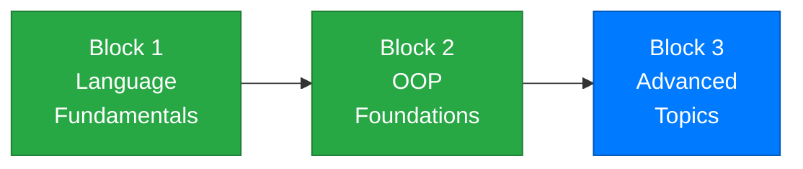

# Week 13 – Generics, Enums, and Nullable Types

[← Back to Course Home](../../README.md)

---

## 📋 Overview

So far in this course, you've built classes, used inheritance and interfaces, and learned to handle errors gracefully. This week adds three powerful C# features that make your code **safer, more expressive, and more flexible**.

**Generics** let you write classes and methods that work with *any* type while keeping full type safety — no more casting, no more runtime surprises. You've already been using generics every time you wrote `List<string>` or `List<int>`. This week, you'll understand *why* the angle brackets exist and learn to write your own generic code.

**Enums** give you a way to define a fixed set of named values — like days of the week, order statuses, or difficulty levels — instead of scattering magic strings and numbers throughout your code.

**Nullable types** address one of the most common bugs in programming: the dreaded `NullReferenceException`. You'll learn how C# lets you explicitly say "this value might be missing" and provides operators to handle that safely.

> **Analogy:** Think of generics like a vending machine — the machine's *mechanism* is the same regardless of what's inside (sodas, snacks, toys), but it only dispenses the type you loaded it with. Enums are like the buttons on that machine — a fixed set of valid choices. And nullable types are like a slot that might be empty — you check before reaching in.

---

## 🎯 Learning Objectives

By the end of this week, you will be able to:

1. Explain why generics exist and how they provide type safety with flexibility
2. Use generic collections: `List<T>`, `Dictionary<TKey, TValue>`, `Queue<T>`, `Stack<T>`
3. Write a simple generic class and generic method
4. Define and use enums for fixed sets of named values
5. Use enums with `switch` statements for clean decision logic
6. Work with nullable value types (`int?`, `bool?`) and understand when values can be absent
7. Use the null-coalescing operators (`??`, `??=`) for safe default values
8. Understand the concept of nullable reference types

---

## 📚 Lectures

| Lecture | Topic | Duration |
|---------|-------|----------|
| [Lecture 1](./lecture-1.md) | Generics — Why They Exist and How to Use Them | 45 min |
| [Lecture 2](./lecture-2.md) | Enums — Named Constants Done Right | 45 min |
| [Lecture 3](./lecture-3.md) | Nullable Types and Null Safety | 45 min |

---

## 🗺️ Where You Are



```
✅ Week 1  – Getting Started          ✅ Week 7  – Classes & Objects
✅ Week 2  – Variables & Types         ✅ Week 8  – Encapsulation
✅ Week 3  – Conditionals              ✅ Week 9  – Inheritance
✅ Week 4  – Loops                     ✅ Week 10 – Polymorphism
✅ Week 5  – Methods                   ✅ Week 11 – Interfaces
✅ Week 6  – Arrays & Collections      ✅ Week 12 – Exception Handling
                                       👉 Week 13 – Generics, Enums, Nullables ← YOU ARE HERE
```

---

## 🔗 Prerequisites

Before starting this week, make sure you're comfortable with:

- **Collections** (Week 6) — you've used `List<T>` already; now you'll understand the `<T>` part
- **Classes and OOP** (Weeks 7–11) — generics build on your understanding of types and class design
- **Exception handling** (Week 12) — nullable types help prevent exceptions before they happen

---

## ✅ Week Checklist

- [ ] Complete Lecture 1 — understand generics and use generic collections and custom generic types
- [ ] Complete Lecture 2 — define and use enums, combine them with switch statements
- [ ] Complete Lecture 3 — work with nullable types and null-safety operators
- [ ] Work through the practice exercises
- [ ] Complete the **Game Configuration System** assignment

---

[← Week 12: Exception Handling](../week-12/README.md) | [Week 14: LINQ and Lambda Expressions →](../week-14/README.md)
