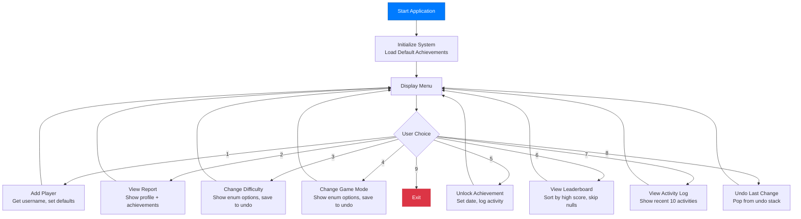

# Week 13 – Assignment: Game Configuration System

[← Back to Week 13 Overview](./README.md)

---

## Overview

Build a **Game Configuration System** — a console application that manages game settings, player profiles, and an achievement system. This assignment integrates all three topics from this week: generics, enums, and nullable types.

You'll create a system where players have customizable settings, earn achievements, and can track their progress — all using type-safe enums, flexible generic collections, and nullable types for optional data.

---

## Requirements

### Part 1: Enums

Define the following enums:

```
Difficulty:     Easy, Normal, Hard, Nightmare
GameMode:       SinglePlayer, CoOp, Multiplayer, Sandbox
AchievementType: Combat, Exploration, Social, Collection, Mastery
ControlScheme:  Keyboard, Controller, Touch
```

### Part 2: Player Profile

Create a `PlayerProfile` class with:

| Property | Type | Notes |
|----------|------|-------|
| `Username` | `string` | Required, cannot be empty |
| `Level` | `int` | Defaults to 1 |
| `Difficulty` | `Difficulty` | Defaults to `Normal` |
| `GameMode` | `GameMode` | Defaults to `SinglePlayer` |
| `ControlScheme` | `ControlScheme?` | Nullable — `null` means "not configured" |
| `PlayTimeHours` | `double?` | Nullable — `null` means "no data yet" |
| `HighScore` | `int?` | Nullable — `null` means "no score yet" |

Include a `ToString()` override that handles null values gracefully using `??` operators.

### Part 3: Achievement System

Create an `Achievement` class with:

| Property | Type | Notes |
|----------|------|-------|
| `Name` | `string` | Achievement title |
| `Description` | `string` | What the player did |
| `Type` | `AchievementType` | Category of achievement |
| `UnlockedDate` | `DateTime?` | `null` if locked, date if unlocked |
| `IsUnlocked` | `bool` | Computed: `UnlockedDate.HasValue` |

### Part 4: Game Configuration Manager

Create a `GameConfigManager` class that manages everything:

**Storage (use these generic collections):**
- `Dictionary<string, PlayerProfile>` — player profiles indexed by username
- `Dictionary<AchievementType, List<Achievement>>` — achievements grouped by type
- `Queue<string>` — recent activity log (max 10 entries — dequeue oldest when full)
- `Stack<string>` — undo history for setting changes

**Required methods:**

| Method | Description |
|--------|-------------|
| `AddPlayer(PlayerProfile player)` | Add a player; throw if username already exists |
| `GetPlayer(string username)` | Return `PlayerProfile?` — null if not found |
| `UpdateDifficulty(string username, Difficulty diff)` | Change difficulty, push old value to undo stack |
| `UpdateGameMode(string username, GameMode mode)` | Change game mode, push old value to undo stack |
| `UndoLastChange()` | Undo the most recent setting change |
| `UnlockAchievement(string username, string achievementName)` | Mark an achievement as unlocked with current date |
| `GetPlayerAchievements(string username, AchievementType? type = null)` | Get achievements; filter by type if provided, all if null |
| `GetLeaderboard()` | Return players sorted by high score (skip null scores) |
| `LogActivity(string message)` | Add to activity queue; remove oldest if over 10 |
| `PrintPlayerReport(string username)` | Display full profile, achievements, and stats |

### Part 5: Console Menu

Create a menu-driven application:

```
=== Game Configuration System ===
1. Add Player
2. View Player Report
3. Change Difficulty
4. Change Game Mode
5. Unlock Achievement
6. View Leaderboard
7. View Activity Log
8. Undo Last Change
9. Exit
```

---

## Program Flow



---

## Sample Output

```
=== Game Configuration System ===
1. Add Player
...
Choice: 1

Enter username: DragonSlayer
Player 'DragonSlayer' created successfully!

Choice: 2
Enter username: DragonSlayer

=== Player Report: DragonSlayer ===
Level: 1
Difficulty: Normal
Game Mode: SinglePlayer
Controls: Not configured
Play Time: No data
High Score: No score yet

Achievements: None unlocked

Choice: 3
Enter username: DragonSlayer
Current difficulty: Normal
Available: Easy(0), Normal(1), Hard(2), Nightmare(3)
Select difficulty: 2
Difficulty changed to Hard.

Choice: 5
Enter username: DragonSlayer
Achievement categories: Combat(0), Exploration(1), Social(2), Collection(3), Mastery(4)
Select category: 0
Available Combat achievements:
  1. First Blood — Defeat your first enemy
  2. Warrior — Defeat 100 enemies
Select achievement: 1
Achievement 'First Blood' unlocked!

Choice: 7
=== Recent Activity ===
[2025-03-15 14:30] DragonSlayer: Difficulty changed to Hard
[2025-03-15 14:31] DragonSlayer: Unlocked 'First Blood'

Choice: 8
Undid: DragonSlayer difficulty Hard → Normal
```

---

## Starter Code

Use this as your starting point for default achievements:

```csharp
static Dictionary<AchievementType, List<Achievement>> CreateDefaultAchievements()
{
    return new Dictionary<AchievementType, List<Achievement>>
    {
        {
            AchievementType.Combat, new List<Achievement>
            {
                new Achievement { Name = "First Blood", Description = "Defeat your first enemy", Type = AchievementType.Combat },
                new Achievement { Name = "Warrior", Description = "Defeat 100 enemies", Type = AchievementType.Combat },
                new Achievement { Name = "Champion", Description = "Defeat a boss", Type = AchievementType.Combat }
            }
        },
        {
            AchievementType.Exploration, new List<Achievement>
            {
                new Achievement { Name = "Explorer", Description = "Discover 10 locations", Type = AchievementType.Exploration },
                new Achievement { Name = "Cartographer", Description = "Map the entire world", Type = AchievementType.Exploration }
            }
        },
        {
            AchievementType.Social, new List<Achievement>
            {
                new Achievement { Name = "Friendly", Description = "Make your first friend", Type = AchievementType.Social },
                new Achievement { Name = "Leader", Description = "Create a guild", Type = AchievementType.Social }
            }
        },
        {
            AchievementType.Collection, new List<Achievement>
            {
                new Achievement { Name = "Collector", Description = "Collect 50 items", Type = AchievementType.Collection },
                new Achievement { Name = "Hoarder", Description = "Collect 500 items", Type = AchievementType.Collection }
            }
        },
        {
            AchievementType.Mastery, new List<Achievement>
            {
                new Achievement { Name = "Completionist", Description = "Unlock all other achievements", Type = AchievementType.Mastery }
            }
        }
    };
}
```

---

## Grading Rubric

| Criteria | Points |
|----------|--------|
| **Enums** — All 4 enums defined correctly, used throughout (no magic strings/numbers) | 15 |
| **Player Profile** — Class with proper types, nullable fields, `ToString()` with null handling | 15 |
| **Achievement System** — Class with nullable `UnlockedDate`, grouping by `AchievementType` | 15 |
| **Generic Collections** — Correct use of `Dictionary`, `Queue`, `Stack`, `List` | 15 |
| **Nullable Handling** — Consistent use of `??`, `?.`, `HasValue` throughout | 15 |
| **Menu System** — All options work correctly with proper input validation | 10 |
| **Undo Feature** — Stack-based undo correctly reverts setting changes | 10 |
| **Code Quality** — Clean organization, meaningful names, no magic values | 5 |
| **Total** | **100** |

---

## Bonus Challenges

1. **Import/Export:** Serialize player profiles to a text file and load them back using `Dictionary` and enum parsing
2. **Achievement Progress:** Add an `int? Progress` and `int Target` to achievements (e.g., "Defeat 50/100 enemies") — auto-unlock when progress reaches target
3. **Multiple Profiles:** Allow switching between player profiles with a "Select Active Player" menu option
4. **Statistics Dashboard:** Show aggregate stats — most popular difficulty, average play time (ignoring nulls), total achievements unlocked across all players
5. **Difficulty Scaling:** Create a generic `Setting<T>` class that tracks a setting's value and its history (using `Stack<T>`), replacing individual undo entries

---

[← Back to Week 13 Overview](./README.md)
