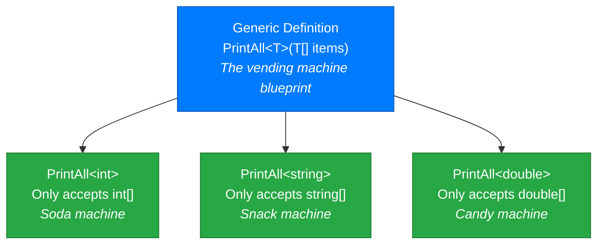
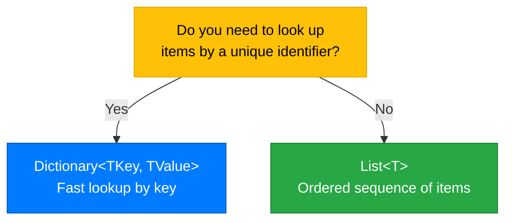

# Lecture 1: Generics — Why They Exist and How to Use Them

[Back to Week 13 Overview](./README.md) | [Next: Lecture 2 – Enums — Named Constants Done Right →](./lecture-2.md)

---

## Lecture Overview

| Item | Detail |
|------|--------|
| Duration | 45 minutes |
| Topics | Why generics exist, generic collections (`List<T>`, `Dictionary<TKey, TValue>`, `Queue<T>`, `Stack<T>`), writing generic classes and methods |
| Preparation | Comfortable with `List<T>` from Week 6, classes from Weeks 7–11 |

---

## 1. The Problem: Code That Repeats Itself for Every Type

Imagine you need a method that prints every item in a collection. Without generics, you'd write one for each type:

```csharp
static void PrintAllInts(int[] items)
{
    foreach (int item in items)
    {
        Console.WriteLine(item);
    }
}

static void PrintAllStrings(string[] items)
{
    foreach (string item in items)
    {
        Console.WriteLine(item);
    }
}

static void PrintAllDoubles(double[] items)
{
    foreach (double item in items)
    {
        Console.WriteLine(item);
    }
}
```

These methods are **identical** except for the type. That's three methods doing the same thing. What if you need this for 10 types? 50?

### The "Object" Approach (Before Generics)

Early C# solved this with `object` — since everything inherits from `object`:

```csharp
static void PrintAll(object[] items)
{
    foreach (object item in items)
    {
        Console.WriteLine(item);
    }
}
```

But this creates new problems:

```csharp
object[] mixed = new object[] { 42, "hello", true, 3.14 };
PrintAll(mixed); // Works, but no type safety!

// You can accidentally mix types
object[] numbers = new object[] { 1, 2, "three", 4 }; // "three" sneaks in!

// Getting values back requires casting
int first = (int)numbers[0]; // Works
int third = (int)numbers[2]; // 💥 Runtime crash! "three" is not an int
```

**Problems with the `object` approach:**
- No compile-time type checking — errors happen at runtime
- Requires casting to get values back
- **Boxing** for value types — `int` gets wrapped in an `object`, which costs performance

---

## 2. Generics to the Rescue

Generics let you write code that works with **any type** while keeping full **type safety**. The type is specified when you *use* the code, not when you *write* it.

```csharp
// The <T> is a "type parameter" — a placeholder for a real type
static void PrintAll<T>(T[] items)
{
    foreach (T item in items)
    {
        Console.WriteLine(item);
    }
}
```

Now you can call it with any type:

```csharp
int[] numbers = { 1, 2, 3, 4, 5 };
string[] names = { "Alice", "Bob", "Charlie" };
double[] prices = { 9.99, 19.99, 29.99 };

PrintAll<int>(numbers);       // T becomes int
PrintAll<string>(names);      // T becomes string
PrintAll<double>(prices);     // T becomes double

// C# can often infer the type, so you can skip the <type>
PrintAll(numbers);   // Compiler knows T is int from the argument
PrintAll(names);     // Compiler knows T is string
```

### How Generics Work — The Vending Machine Analogy



Think of `<T>` as a slot on the machine — you *configure* it when you use it. Once configured for sodas, it only accepts and dispenses sodas. The mechanism is the same; the type is different.

---

## 3. Generic Collections You Already Know

You've been using generics since Week 6! Let's look at the collections you know — and some new ones.

### `List<T>` — Dynamic Array (Review)

```csharp
List<string> names = new List<string>();
names.Add("Alice");
names.Add("Bob");
// names.Add(42);  // ❌ Compile error! Only strings allowed

Console.WriteLine(names[0]); // "Alice" — no casting needed
Console.WriteLine(names.Count); // 2
```

The `<string>` in `List<string>` is the generic type argument — it tells the list what type of items it holds.

### `Dictionary<TKey, TValue>` — Key-Value Pairs

A dictionary stores data as **key-value pairs** — like a real dictionary where you look up a word (key) to find its definition (value).

```csharp
// Key: student name (string), Value: their grade (int)
Dictionary<string, int> grades = new Dictionary<string, int>();

// Adding entries
grades.Add("Alice", 95);
grades.Add("Bob", 87);
grades["Charlie"] = 92; // Alternative syntax — also adds

// Accessing values by key
Console.WriteLine(grades["Alice"]); // 95

// Checking if a key exists (avoids KeyNotFoundException)
if (grades.ContainsKey("Dave"))
{
    Console.WriteLine(grades["Dave"]);
}
else
{
    Console.WriteLine("Dave not found");
}

// Safer approach with TryGetValue
if (grades.TryGetValue("Bob", out int bobGrade))
{
    Console.WriteLine($"Bob's grade: {bobGrade}");
}

// Iterating — each entry is a KeyValuePair<TKey, TValue>
foreach (KeyValuePair<string, int> entry in grades)
{
    Console.WriteLine($"{entry.Key}: {entry.Value}");
}

// Shorter with var
foreach (var entry in grades)
{
    Console.WriteLine($"{entry.Key}: {entry.Value}");
}
```

**Output:**
```
95
Dave not found
Bob's grade: 87
Alice: 95
Bob: 87
Charlie: 92
```

**Key rules for `Dictionary`:**
- Keys must be **unique** — adding a duplicate key throws an exception
- Use `ContainsKey()` or `TryGetValue()` before accessing to avoid crashes
- Order is **not guaranteed** (don't rely on insertion order)

### When to Use Dictionary vs List



### `Queue<T>` — First In, First Out (FIFO)

A queue works like a line at a store — the first person in line is the first to be served.

```csharp
Queue<string> printQueue = new Queue<string>();

// Enqueue adds to the back
printQueue.Enqueue("Document1.pdf");
printQueue.Enqueue("Photo.jpg");
printQueue.Enqueue("Report.docx");

Console.WriteLine($"Items in queue: {printQueue.Count}"); // 3

// Peek looks at the front without removing
Console.WriteLine($"Next up: {printQueue.Peek()}"); // Document1.pdf

// Dequeue removes from the front
string next = printQueue.Dequeue();
Console.WriteLine($"Printing: {next}"); // Document1.pdf
Console.WriteLine($"Remaining: {printQueue.Count}"); // 2

// Process entire queue
while (printQueue.Count > 0)
{
    string doc = printQueue.Dequeue();
    Console.WriteLine($"Printing: {doc}");
}
```

**Output:**
```
Items in queue: 3
Next up: Document1.pdf
Printing: Document1.pdf
Remaining: 2
Printing: Photo.jpg
Printing: Report.docx
```

### `Stack<T>` — Last In, First Out (LIFO)

A stack works like a stack of plates — you add and remove from the top.

```csharp
Stack<string> undoHistory = new Stack<string>();

// Push adds to the top
undoHistory.Push("Typed 'Hello'");
undoHistory.Push("Made text bold");
undoHistory.Push("Changed font size");

Console.WriteLine($"Actions: {undoHistory.Count}"); // 3

// Peek looks at the top without removing
Console.WriteLine($"Last action: {undoHistory.Peek()}"); // Changed font size

// Pop removes from the top
string lastAction = undoHistory.Pop();
Console.WriteLine($"Undoing: {lastAction}"); // Changed font size
Console.WriteLine($"Remaining: {undoHistory.Count}"); // 2
```

**Output:**
```
Actions: 3
Last action: Changed font size
Undoing: Changed font size
Remaining: 2
```

### Collection Comparison

| Collection | Pattern | Add | Remove | Access | Use When |
|-----------|---------|-----|--------|--------|----------|
| `List<T>` | Index-based | `Add()` | `Remove()` | `[index]` | Ordered sequence, random access |
| `Dictionary<K,V>` | Key-value | `Add()` / `[key]=` | `Remove(key)` | `[key]` | Fast lookup by unique key |
| `Queue<T>` | FIFO | `Enqueue()` | `Dequeue()` | `Peek()` | Processing in order (print jobs, tasks) |
| `Stack<T>` | LIFO | `Push()` | `Pop()` | `Peek()` | Undo history, backtracking, reversals |

---

## 4. Writing Your Own Generic Class

You can create your own generic types. Let's build a simple `Box<T>` that holds one item of any type:

```csharp
class Box<T>
{
    private T _content;
    private bool _hasItem;

    public void Put(T item)
    {
        _content = item;
        _hasItem = true;
        Console.WriteLine($"Stored: {item}");
    }

    public T Take()
    {
        if (!_hasItem)
        {
            throw new InvalidOperationException("The box is empty!");
        }

        T item = _content;
        _content = default;  // Reset to default value for the type
        _hasItem = false;
        return item;
    }

    public bool HasItem => _hasItem;

    public override string ToString()
    {
        return _hasItem ? $"Box containing: {_content}" : "Empty box";
    }
}
```

Using the box with different types:

```csharp
Box<string> nameBox = new Box<string>();
nameBox.Put("Alice");
Console.WriteLine(nameBox);          // Box containing: Alice
string name = nameBox.Take();        // No casting needed!
Console.WriteLine(nameBox);          // Empty box

Box<int> numberBox = new Box<int>();
numberBox.Put(42);
int value = numberBox.Take();        // Returns int directly

Box<List<string>> listBox = new Box<List<string>>();
listBox.Put(new List<string> { "a", "b", "c" });
List<string> myList = listBox.Take(); // Returns List<string>
```

### The `default` Keyword

When working with generics, you sometimes need the default value for a type. The `default` keyword returns:
- `0` for numeric types (`int`, `double`, etc.)
- `false` for `bool`
- `null` for reference types (`string`, classes)

```csharp
Console.WriteLine(default(int));      // 0
Console.WriteLine(default(bool));     // False
Console.WriteLine(default(string));   // (empty — null)
```

---

## 5. Writing a Generic Method

You can also write individual generic methods without making the entire class generic:

```csharp
class Utility
{
    // Generic method — swaps two values of any type
    public static void Swap<T>(ref T a, ref T b)
    {
        T temp = a;
        a = b;
        b = temp;
    }

    // Generic method — finds the index of an item in an array
    public static int FindIndex<T>(T[] array, T target)
    {
        for (int i = 0; i < array.Length; i++)
        {
            if (array[i].Equals(target))
            {
                return i;
            }
        }
        return -1;
    }
}
```

Using generic methods:

```csharp
int x = 10, y = 20;
Utility.Swap(ref x, ref y);
Console.WriteLine($"x={x}, y={y}"); // x=20, y=10

string a = "hello", b = "world";
Utility.Swap(ref a, ref b);
Console.WriteLine($"a={a}, b={b}"); // a=world, b=hello

string[] names = { "Alice", "Bob", "Charlie" };
int index = Utility.FindIndex(names, "Bob");
Console.WriteLine($"Bob is at index {index}"); // Bob is at index 1
```

---

## 6. Complete Example: Student Grade Tracker

Let's combine several generic collections in a practical example:

```csharp
class GradeTracker
{
    private Dictionary<string, List<int>> _studentGrades = new Dictionary<string, List<int>>();

    public void AddGrade(string student, int grade)
    {
        // If the student doesn't exist yet, create their entry
        if (!_studentGrades.ContainsKey(student))
        {
            _studentGrades[student] = new List<int>();
        }

        _studentGrades[student].Add(grade);
        Console.WriteLine($"Added grade {grade} for {student}");
    }

    public double GetAverage(string student)
    {
        if (!_studentGrades.ContainsKey(student))
        {
            throw new ArgumentException($"Student '{student}' not found");
        }

        List<int> grades = _studentGrades[student];
        double sum = 0;
        foreach (int grade in grades)
        {
            sum += grade;
        }
        return sum / grades.Count;
    }

    public void PrintReport()
    {
        Console.WriteLine("\n=== Grade Report ===");
        foreach (var entry in _studentGrades)
        {
            string name = entry.Key;
            List<int> grades = entry.Value;
            double avg = GetAverage(name);

            Console.Write($"{name}: ");
            foreach (int g in grades)
            {
                Console.Write($"{g} ");
            }
            Console.WriteLine($"(Avg: {avg:F1})");
        }
    }
}
```

```csharp
// Program.cs
GradeTracker tracker = new GradeTracker();

tracker.AddGrade("Alice", 95);
tracker.AddGrade("Alice", 88);
tracker.AddGrade("Alice", 92);
tracker.AddGrade("Bob", 78);
tracker.AddGrade("Bob", 85);
tracker.AddGrade("Charlie", 90);

tracker.PrintReport();
```

**Output:**
```
Added grade 95 for Alice
Added grade 88 for Alice
Added grade 92 for Alice
Added grade 78 for Bob
Added grade 85 for Bob
Added grade 90 for Charlie

=== Grade Report ===
Alice: 95 88 92 (Avg: 91.7)
Bob: 78 85 (Avg: 81.5)
Charlie: 90 (Avg: 90.0)
```

---

## Key Takeaways

- **Generics** let you write type-safe code that works with any type — using `<T>` as a type placeholder
- You've been using generics since Week 6: `List<string>`, `List<int>` are generic types
- **`Dictionary<TKey, TValue>`** stores key-value pairs for fast lookup — always check for key existence
- **`Queue<T>`** is FIFO (first in, first out) — use for ordered processing
- **`Stack<T>`** is LIFO (last in, first out) — use for undo, backtracking
- You can write your own generic classes with `class MyClass<T>` and generic methods with `void MyMethod<T>()`
- The `default` keyword gives you the default value for any type
- Generics eliminate the need for casting and catch type errors at **compile time** instead of runtime

---

## Hands-On Exercises

### Exercise 1 — Dictionary Practice
Create a `Dictionary<string, string>` that maps country codes to country names (e.g., "US" → "United States"). Add at least 5 entries. Ask the user for a code and display the country name, or "Not found" if the code doesn't exist.

### Exercise 2 — Queue Simulation
Simulate a customer service queue. Create a `Queue<string>` with 5 customer names. Process them one at a time, printing "Now serving: [name]" and "Customers remaining: [count]" for each.

### Exercise 3 — Stack Undo
Build a simple text editor undo feature. Use a `Stack<string>` to track actions. Add 4 actions, then undo them one by one, printing each undone action.

### Exercise 4 — Generic Pair
Write a generic class `Pair<T1, T2>` with two properties: `First` (type T1) and `Second` (type T2). Include a `ToString()` override that displays both values. Create pairs of different type combinations.

---

[Back to Week 13 Overview](./README.md) | [Next: Lecture 2 – Enums — Named Constants Done Right →](./lecture-2.md)
