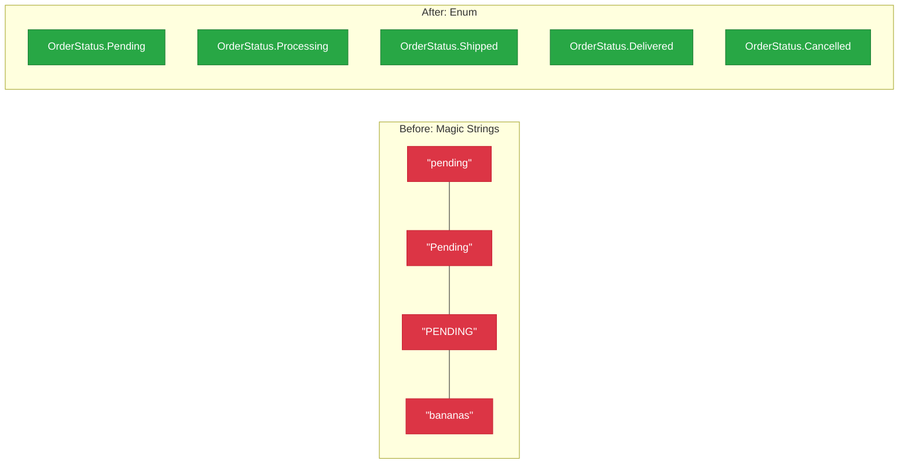

# Lecture 2: Enums — Named Constants Done Right

[← Previous: Lecture 1 – Generics](./lecture-1.md) | [Back to Week 13 Overview](./README.md) | [Next: Lecture 3 – Nullable Types and Null Safety →](./lecture-3.md)

---

## Lecture Overview

| Item | Detail |
|------|--------|
| Duration | 45 minutes |
| Topics | Defining enums, using enums in code, enums with switch, enum methods and casting, flags concept |
| Preparation | Comfortable with classes, switch statements, and generic collections from previous lectures |

---

## 1. The Problem: Magic Strings and Magic Numbers

Look at this code and spot the problems:

```csharp
class Order
{
    public string Status { get; set; }
}

Order order = new Order();
order.Status = "pending";

// Later in the code...
if (order.Status == "Pending")  // ❌ Bug! Capital P vs lowercase p
{
    Console.WriteLine("Order is pending");
}
```

Or with numbers:

```csharp
class Employee
{
    public int Department { get; set; }
}

Employee emp = new Employee();
emp.Department = 3; // What does 3 mean? Marketing? Engineering? HR?

// Somewhere else in the code...
if (emp.Department == 4) // Is 4 even valid?
{
    // ...
}
```

**The problems:**
- **Magic strings** — typos cause silent bugs (`"pending"` vs `"Pending"`)
- **Magic numbers** — nobody knows what `3` or `4` means without comments
- **No validation** — nothing prevents `order.Status = "bananas"` or `emp.Department = 999`
- **No discoverability** — developers must guess or hunt for valid values

---

## 2. Enter Enums

An **enum** (short for "enumeration") defines a **fixed set of named values**. It's a custom type where you list every valid option.

```csharp
enum OrderStatus
{
    Pending,
    Processing,
    Shipped,
    Delivered,
    Cancelled
}
```

Now you use it like any other type:

```csharp
OrderStatus status = OrderStatus.Pending;

Console.WriteLine(status);           // Pending
Console.WriteLine(status.GetType()); // OrderStatus
```

### How Enums Solve the Problems

```csharp
class Order
{
    public OrderStatus Status { get; set; }
}

Order order = new Order();
order.Status = OrderStatus.Pending;     // ✅ Clear, no typos possible
// order.Status = "pending";            // ❌ Compile error — type mismatch
// order.Status = OrderStatus.Bananas;  // ❌ Compile error — not a valid value

if (order.Status == OrderStatus.Pending) // ✅ Always correct — no case issues
{
    Console.WriteLine("Order is pending");
}
```



---

## 3. Defining Enums

### Basic Syntax

```csharp
enum DayOfWeek
{
    Monday,
    Tuesday,
    Wednesday,
    Thursday,
    Friday,
    Saturday,
    Sunday
}
```

### Underlying Values

Every enum value has an **underlying integer**. By default, they start at 0 and increment:

```csharp
enum Season
{
    Spring,    // 0
    Summer,    // 1
    Autumn,    // 2
    Winter     // 3
}

Season s = Season.Summer;
int value = (int)s;
Console.WriteLine(value); // 1
```

You can set custom values:

```csharp
enum HttpStatusCode
{
    OK = 200,
    NotFound = 404,
    InternalServerError = 500
}

Console.WriteLine((int)HttpStatusCode.NotFound); // 404
```

### Casting Between Enum and Int

```csharp
// Enum to int
Season s = Season.Autumn;
int num = (int)s;              // 2

// Int to enum
Season fromInt = (Season)2;     // Season.Autumn

// String to enum
Season fromString = Enum.Parse<Season>("Winter");  // Season.Winter

// Safe parsing
if (Enum.TryParse<Season>("Summer", out Season result))
{
    Console.WriteLine($"Parsed: {result}"); // Parsed: Summer
}
```

---

## 4. Enums with Switch Statements

Enums and `switch` are natural partners. The compiler can even warn you if you miss a case:

```csharp
enum Priority
{
    Low,
    Medium,
    High,
    Critical
}

static string GetPriorityMessage(Priority priority)
{
    switch (priority)
    {
        case Priority.Low:
            return "No rush — handle when convenient.";
        case Priority.Medium:
            return "Should be addressed soon.";
        case Priority.High:
            return "Needs attention today.";
        case Priority.Critical:
            return "Drop everything and fix this now!";
        default:
            return "Unknown priority.";
    }
}

// Usage
Priority p = Priority.High;
Console.WriteLine(GetPriorityMessage(p));
// Output: Needs attention today.
```

### Switch Expressions (Cleaner Syntax)

C# also supports **switch expressions** — a more compact form:

```csharp
static string GetPriorityMessage(Priority priority) => priority switch
{
    Priority.Low      => "No rush — handle when convenient.",
    Priority.Medium   => "Should be addressed soon.",
    Priority.High     => "Needs attention today.",
    Priority.Critical => "Drop everything and fix this now!",
    _                 => "Unknown priority."
};
```

The `_` is a **discard** — it matches anything not covered by the other cases (like `default`).

---

## 5. Enums in Classes — Practical Examples

### Example 1: Traffic Light

```csharp
enum TrafficLight
{
    Red,
    Yellow,
    Green
}

class TrafficController
{
    public TrafficLight CurrentLight { get; private set; } = TrafficLight.Red;

    public void Next()
    {
        CurrentLight = CurrentLight switch
        {
            TrafficLight.Red    => TrafficLight.Green,
            TrafficLight.Green  => TrafficLight.Yellow,
            TrafficLight.Yellow => TrafficLight.Red,
            _ => TrafficLight.Red
        };
    }

    public string GetInstruction() => CurrentLight switch
    {
        TrafficLight.Red    => "STOP",
        TrafficLight.Green  => "GO",
        TrafficLight.Yellow => "CAUTION — prepare to stop",
        _ => "Unknown"
    };
}
```

```csharp
TrafficController controller = new TrafficController();

for (int i = 0; i < 6; i++)
{
    Console.WriteLine($"Light: {controller.CurrentLight} — {controller.GetInstruction()}");
    controller.Next();
}
```

**Output:**
```
Light: Red — STOP
Light: Green — GO
Light: Yellow — CAUTION — prepare to stop
Light: Red — STOP
Light: Green — GO
Light: Yellow — CAUTION — prepare to stop
```

### Example 2: User Roles with Permissions

```csharp
enum UserRole
{
    Guest,
    Member,
    Moderator,
    Admin
}

class User
{
    public string Name { get; set; }
    public UserRole Role { get; set; }

    public bool CanEdit() => Role == UserRole.Moderator || Role == UserRole.Admin;
    public bool CanDelete() => Role == UserRole.Admin;
    public bool CanView() => true; // Everyone can view

    public override string ToString()
    {
        return $"{Name} ({Role})";
    }
}
```

```csharp
User alice = new User { Name = "Alice", Role = UserRole.Admin };
User bob = new User { Name = "Bob", Role = UserRole.Member };

Console.WriteLine($"{alice} — Can edit: {alice.CanEdit()}, Can delete: {alice.CanDelete()}");
Console.WriteLine($"{bob} — Can edit: {bob.CanEdit()}, Can delete: {bob.CanDelete()}");
```

**Output:**
```
Alice (Admin) — Can edit: True, Can delete: True
Bob (Member) — Can edit: False, Can delete: False
```

---

## 6. Useful Enum Methods

C# provides several built-in methods for working with enums:

```csharp
enum Color
{
    Red,
    Green,
    Blue,
    Yellow
}

// Get all values
Color[] allColors = Enum.GetValues<Color>();
foreach (Color c in allColors)
{
    Console.WriteLine(c);
}

// Get all names as strings
string[] names = Enum.GetNames<Color>();
// ["Red", "Green", "Blue", "Yellow"]

// Check if a value is defined
bool exists = Enum.IsDefined(typeof(Color), "Red");     // true
bool exists2 = Enum.IsDefined(typeof(Color), "Purple");  // false
bool exists3 = Enum.IsDefined(typeof(Color), 1);         // true (Green = 1)
```

### Enum Menu Pattern

A common pattern — using an enum to drive a menu:

```csharp
enum MenuOption
{
    AddItem = 1,
    ViewItems = 2,
    RemoveItem = 3,
    Exit = 4
}

Console.WriteLine("1. Add Item");
Console.WriteLine("2. View Items");
Console.WriteLine("3. Remove Item");
Console.WriteLine("4. Exit");

Console.Write("Choice: ");
if (int.TryParse(Console.ReadLine(), out int choice) 
    && Enum.IsDefined(typeof(MenuOption), choice))
{
    MenuOption selected = (MenuOption)choice;

    switch (selected)
    {
        case MenuOption.AddItem:
            Console.WriteLine("Adding item...");
            break;
        case MenuOption.ViewItems:
            Console.WriteLine("Viewing items...");
            break;
        case MenuOption.RemoveItem:
            Console.WriteLine("Removing item...");
            break;
        case MenuOption.Exit:
            Console.WriteLine("Goodbye!");
            break;
    }
}
else
{
    Console.WriteLine("Invalid option.");
}
```

---

## 7. Where to Place Enums

Enums are typically defined:
- **Outside any class** in their own file or a shared file — when used by multiple classes
- **Inside a class** — when only that class uses them (less common)

```csharp
// File: OrderStatus.cs
namespace MyApp
{
    enum OrderStatus
    {
        Pending,
        Processing,
        Shipped,
        Delivered,
        Cancelled
    }
}

// File: Order.cs
namespace MyApp
{
    class Order
    {
        public OrderStatus Status { get; set; }
    }
}
```

---

## Key Takeaways

- **Enums** define a fixed set of named values — replacing magic strings and magic numbers
- Enums are **type-safe** — the compiler prevents invalid values
- Each enum value has an **underlying integer** (default starts at 0)
- Enums pair naturally with **switch statements** and **switch expressions**
- Use `Enum.Parse<T>()` and `Enum.TryParse<T>()` to convert strings to enum values
- Use `(int)` casting to get the numeric value, and `(MyEnum)` to go back
- Define enums **outside classes** when shared, typically in their own file
- Common uses: statuses, roles, categories, directions, priorities, menu options

---

## Hands-On Exercises

### Exercise 1 — Season Display
Define a `Season` enum. Write a method that takes a `Season` and returns a string describing typical activities for that season. Use a switch expression.

### Exercise 2 — Card Suit
Define a `Suit` enum (Hearts, Diamonds, Clubs, Spades) and a `Rank` enum (Ace through King). Create a `Card` class using both enums. Create and display 5 different cards.

### Exercise 3 — Order Workflow
Create an `OrderStatus` enum and an `Order` class. Add a method `AdvanceStatus()` that moves the order through: Pending → Processing → Shipped → Delivered. Throw an exception if the order is already delivered or cancelled.

---

[← Previous: Lecture 1 – Generics](./lecture-1.md) | [Back to Week 13 Overview](./README.md) | [Next: Lecture 3 – Nullable Types and Null Safety →](./lecture-3.md)
