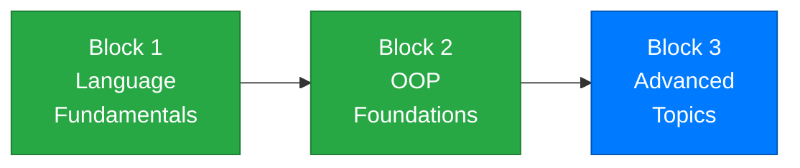

# Week 14 – LINQ and Lambda Expressions

[← Back to Course Home](../../README.md)

---

## 📋 Overview

Every program you've written so far that works with collections — filtering a list, finding the highest value, sorting items — has used loops. Loops work, but they're verbose. You write the same patterns over and over: iterate, check a condition, add to a new list, return the result.

This week, you'll learn **LINQ** (Language Integrated Query) and **lambda expressions** — tools that let you express those same operations in a single, readable line. Instead of writing a 6-line loop to find all students with a GPA above 3.5, you'll write:

```csharp
var honorStudents = students.Where(s => s.Gpa > 3.5).ToList();
```

That's it. One line. Readable, expressive, and powerful.

LINQ isn't just a convenience — it's how professional C# developers work with data every day. When you move on to database courses and web development with Entity Framework, you'll use this exact same syntax to query databases. Mastering LINQ now means you're ready for what comes next.

> **Analogy:** Think of LINQ like a search engine for your data. Instead of manually looking through every item one by one (loops), you describe *what you want* and LINQ finds it for you — just like typing a search query instead of browsing every page on the internet.

---

## 🎯 Learning Objectives

By the end of this week, you will be able to:

1. Explain what LINQ is and why it replaces many common loop patterns
2. Write **lambda expressions** using the `=>` syntax
3. Use **filtering** methods (`Where`) to select items that match a condition
4. Use **projection** methods (`Select`) to transform data into new shapes
5. Use **ordering** methods (`OrderBy`, `OrderByDescending`) to sort collections
6. Use **aggregation** methods (`Count`, `Sum`, `Average`, `Min`, `Max`)
7. Use **element** methods (`First`, `FirstOrDefault`, `Any`, `All`)
8. **Chain** multiple LINQ methods together for complex queries
9. Use LINQ on `List<T>` of objects to filter, project, and sort real data
10. Use **`GroupBy`** for basic grouping operations
11. Convert LINQ results to concrete collections with `ToList()`

---

## 📚 Materials

| # | Material | Topic |
|---|----------|-------|
| 1 | [Lecture 1 – Lambda Expressions and Introduction to LINQ](./lecture-1.md) | Lambda syntax, `Where`, `Select`, `OrderBy`, method chaining |
| 2 | [Lecture 2 – Aggregation, Element Methods, and LINQ on Objects](./lecture-2.md) | `Count`, `Sum`, `Average`, `Min`, `Max`, `First`, `Any`, `All`, LINQ on custom classes |
| 3 | [Lecture 3 – GroupBy, Advanced Chaining, and Real-World Patterns](./lecture-3.md) | `GroupBy`, complex queries, LINQ replacing loops, looking ahead |
| 4 | [Exercises](./exercises.md) | Practice problems for each lecture |
| 5 | [Assignment](./assignment.md) | 📝 Employee Report Generator — mini-project |

---

## 🗺️ Where Are We?



```
✅ Week 1  – Getting Started          ✅ Week 7  – Classes & Objects
✅ Week 2  – Variables & Types         ✅ Week 8  – Encapsulation
✅ Week 3  – Conditionals              ✅ Week 9  – Inheritance
✅ Week 4  – Loops                     ✅ Week 10 – Polymorphism
✅ Week 5  – Methods                   ✅ Week 11 – Interfaces
✅ Week 6  – Arrays & Collections      ✅ Week 12 – Exception Handling
                                       ✅ Week 13 – Generics & Enums
                                       👉 Week 14 – LINQ & Lambdas ← YOU ARE HERE
                                       ⬜ Week 15 – Integration
```

---

## 🔗 Prerequisites

Before starting this week, make sure you're comfortable with:

- **Collections** (Week 6, 13) — `List<T>`, `Dictionary<TKey, TValue>`, iterating with `foreach`
- **Classes and Objects** (Weeks 7–8) — you'll apply LINQ to lists of custom objects
- **Methods** (Week 5) — LINQ methods are called on collections just like any other method
- **Generics** (Week 13) — LINQ returns generic types like `IEnumerable<T>`

---

## ✅ Week Checklist

- [ ] Complete Lecture 1 — understand lambdas, `Where`, `Select`, `OrderBy`, and chaining
- [ ] Complete Lecture 2 — use aggregation and element methods, apply LINQ to object collections
- [ ] Complete Lecture 3 — use `GroupBy`, build complex queries, understand LINQ patterns
- [ ] Work through the practice exercises
- [ ] Complete the **Employee Report Generator** assignment

---

[← Week 13: Generics, Enums & Nullables](../week-13/README.md) | [Week 15: Integration & Looking Ahead →](../week-15/README.md)
