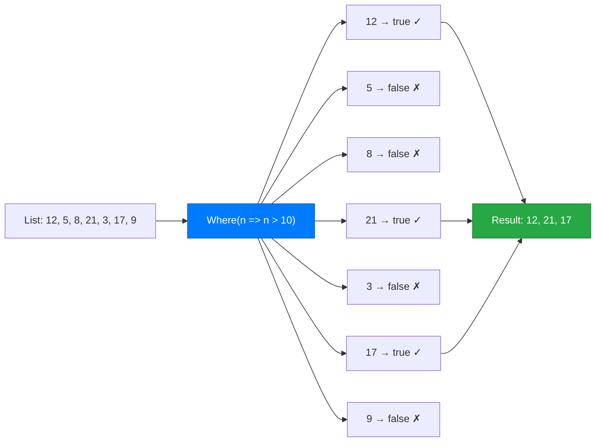
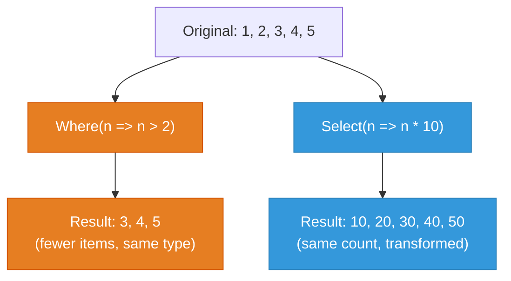
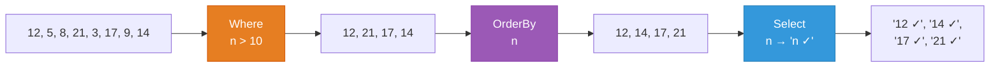

# Lecture 1: Lambda Expressions and Introduction to LINQ

[Back to Week 14 Overview](./README.md) | [Next: Lecture 2 – Aggregation, Element Methods, and LINQ on Objects →](./lecture-2.md)

---

## Lecture Overview

| Item | Detail |
|------|--------|
| Duration | 45 minutes |
| Topics | Lambda expression syntax, `Where`, `Select`, `OrderBy`, `OrderByDescending`, method chaining, `ToList()` |
| Preparation | Comfortable with `List<T>`, `foreach`, classes, and methods |

---

## 1. The Problem: Loops Are Repetitive

Consider how many times you've written code like this:

```csharp
List<int> numbers = new List<int> { 12, 5, 8, 21, 3, 17, 9 };

// Find all numbers greater than 10
List<int> bigNumbers = new List<int>();
foreach (int n in numbers)
{
    if (n > 10)
    {
        bigNumbers.Add(n);
    }
}

// Sort them
bigNumbers.Sort();

// Print them
foreach (int n in bigNumbers)
{
    Console.WriteLine(n);
}
```

**Output:**
```
12
17
21
```

That's 14 lines of code to filter and sort a list. You've probably written variations of this pattern dozens of times by now — iterate, check a condition, build a new list. Every time, the *structure* is the same; only the *condition* changes.

What if you could express all of that in one line?

```csharp
var bigNumbers = numbers.Where(n => n > 10).OrderBy(n => n).ToList();
```

Same result. One line. That's **LINQ**.

---

## 2. What Is LINQ?

**LINQ** stands for **Language Integrated Query**. It's a set of methods built into C# that let you **query, filter, sort, and transform collections** using a consistent, readable syntax.

```
LINQ = a way to ask questions about your data
```

Instead of writing *how* to loop through data step by step (imperative), you describe *what* you want (declarative):

| Approach | Style | Example |
|----------|-------|---------|
| **Loop** (imperative) | "Go through each item, check if it's > 10, if so add it to a new list" | `foreach` + `if` + `Add` |
| **LINQ** (declarative) | "Give me all items where value > 10" | `.Where(n => n > 10)` |

LINQ methods are available on any collection that implements `IEnumerable<T>` — which includes `List<T>`, arrays, `Dictionary` values, and more. You need this `using` directive at the top of your file:

```csharp
using System.Linq;
```

> **Note:** In modern .NET projects (6+), this is often included automatically via global usings. If a LINQ method isn't recognized, add the `using` line.

---

## 3. Lambda Expressions — The Key to LINQ

Before diving into LINQ methods, you need to understand **lambda expressions** — the small inline functions you pass to LINQ methods.

### What Is a Lambda?

A lambda expression is a **short, anonymous function** — a function without a name that you write right where you need it.

```csharp
n => n > 10
```

Read this as: **"given `n`, return whether `n` is greater than 10"**

### Anatomy of a Lambda

```
   parameter(s)    arrow    expression (body)
       │             │            │
       n      =>     n > 10
```

| Part | Description |
|------|-------------|
| `n` | The input parameter — represents each element in the collection |
| `=>` | The "goes to" arrow — separates parameter from body |
| `n > 10` | The body — what to do with each element |

### Lambda vs Regular Method

A lambda is essentially a shorthand for a method:

```csharp
// Regular method
bool IsGreaterThanTen(int n)
{
    return n > 10;
}

// Equivalent lambda
n => n > 10
```

The compiler figures out the types from context, so you don't need to declare `int n` or write `return` — it's all inferred.

### Multiple Parameters

When a lambda needs more than one parameter, wrap them in parentheses:

```csharp
(x, y) => x + y
```

### Multi-Line Lambda Body

If the body needs multiple statements, use curly braces and an explicit `return`:

```csharp
n => {
    int doubled = n * 2;
    return doubled + 1;
}
```

> **Tip:** Most LINQ lambdas are simple one-liners. If your lambda needs multiple lines, that's often a sign you should extract it into a named method instead.

### Diagram: How Lambdas Work in LINQ



The lambda `n => n > 10` is called **once for each element** in the list. LINQ passes each element as `n`, the lambda returns `true` or `false`, and LINQ keeps only the `true` results.

---

## 4. `Where` — Filtering Data

`Where` is the most common LINQ method. It **filters** a collection, keeping only the elements that satisfy a condition.

### Syntax

```csharp
collection.Where(element => condition)
```

The lambda must return a `bool` — `true` to keep the element, `false` to exclude it.

### Example: Filter Numbers

```csharp
List<int> numbers = new List<int> { 1, 2, 3, 4, 5, 6, 7, 8, 9, 10 };

var evens = numbers.Where(n => n % 2 == 0).ToList();

foreach (int n in evens)
{
    Console.WriteLine(n);
}
```

**Output:**
```
2
4
6
8
10
```

### Example: Filter Strings

```csharp
List<string> names = new List<string> { "Alice", "Bob", "Amanda", "Charlie", "Anna" };

var aNames = names.Where(name => name.StartsWith("A")).ToList();

foreach (string name in aNames)
{
    Console.WriteLine(name);
}
```

**Output:**
```
Alice
Amanda
Anna
```

### Multiple Conditions

Use `&&` and `||` inside the lambda just like in an `if` statement:

```csharp
List<int> numbers = new List<int> { 1, 2, 3, 4, 5, 6, 7, 8, 9, 10 };

var result = numbers.Where(n => n > 3 && n < 8).ToList();
// Result: 4, 5, 6, 7
```

---

## 5. `Select` — Transforming Data

`Select` **transforms** (or "projects") each element into a new form. While `Where` asks "which items do I want?", `Select` asks "what shape should each item take?"

### Syntax

```csharp
collection.Select(element => transformation)
```

### Example: Transform Numbers

```csharp
List<int> numbers = new List<int> { 1, 2, 3, 4, 5 };

var doubled = numbers.Select(n => n * 2).ToList();

foreach (int n in doubled)
{
    Console.WriteLine(n);
}
```

**Output:**
```
2
4
6
8
10
```

### Example: Transform to Strings

`Select` can change the *type* of the result:

```csharp
List<int> numbers = new List<int> { 1, 2, 3, 4, 5 };

var labels = numbers.Select(n => $"Item #{n}").ToList();

foreach (string label in labels)
{
    Console.WriteLine(label);
}
```

**Output:**
```
Item #1
Item #2
Item #3
Item #4
Item #5
```

### Example: Extract a Property

When working with objects, `Select` is often used to pull out a single property:

```csharp
List<string> names = new List<string> { "Alice", "Bob", "Charlie" };

var lengths = names.Select(name => name.Length).ToList();
// Result: 5, 3, 7
```

### Diagram: Where vs Select



| Method | What It Does | Items In → Out | Type Can Change? |
|--------|-------------|----------------|------------------|
| `Where` | Filters | Many → Fewer (or same) | No |
| `Select` | Transforms | Same count | Yes |

---

## 6. `OrderBy` and `OrderByDescending` — Sorting Data

These methods sort a collection based on a key you specify.

### Syntax

```csharp
collection.OrderBy(element => key)          // ascending (A→Z, 1→9)
collection.OrderByDescending(element => key) // descending (Z→A, 9→1)
```

### Example: Sort Numbers

```csharp
List<int> numbers = new List<int> { 5, 3, 8, 1, 9, 2 };

var ascending = numbers.OrderBy(n => n).ToList();
// Result: 1, 2, 3, 5, 8, 9

var descending = numbers.OrderByDescending(n => n).ToList();
// Result: 9, 8, 5, 3, 2, 1
```

### Example: Sort Strings by Length

```csharp
List<string> words = new List<string> { "banana", "fig", "cherry", "apple" };

var byLength = words.OrderBy(w => w.Length).ToList();

foreach (string word in byLength)
{
    Console.WriteLine($"{word} ({word.Length} letters)");
}
```

**Output:**
```
fig (3 letters)
apple (5 letters)
banana (6 letters)
cherry (6 letters)
```

### Secondary Sorting with `ThenBy`

What if two items have the same key? Use `ThenBy` for a secondary sort:

```csharp
List<string> words = new List<string> { "banana", "fig", "cherry", "apple" };

var sorted = words.OrderBy(w => w.Length).ThenBy(w => w).ToList();

foreach (string word in sorted)
{
    Console.WriteLine($"{word} ({word.Length} letters)");
}
```

**Output:**
```
fig (3 letters)
apple (5 letters)
banana (6 letters)
cherry (6 letters)
```

Here, `banana` and `cherry` have the same length (6), so `ThenBy(w => w)` sorts them alphabetically.

---

## 7. Method Chaining — Combining Operations

The real power of LINQ comes from **chaining** methods together. Each method returns a new sequence, so you can call another method right on the result.

### Syntax

```csharp
collection
    .Where(...)
    .OrderBy(...)
    .Select(...)
    .ToList();
```

### Example: Filter, Sort, and Transform

```csharp
List<int> numbers = new List<int> { 12, 5, 8, 21, 3, 17, 9, 14 };

var result = numbers
    .Where(n => n > 10)          // Keep: 12, 21, 17, 14
    .OrderBy(n => n)              // Sort: 12, 14, 17, 21
    .Select(n => $"{n} ✓")       // Transform: "12 ✓", "14 ✓", "17 ✓", "21 ✓"
    .ToList();

foreach (string item in result)
{
    Console.WriteLine(item);
}
```

**Output:**
```
12 ✓
14 ✓
17 ✓
21 ✓
```

### Diagram: Chain Flow



### Formatting Long Chains

Put each method on its own line for readability:

```csharp
var result = students
    .Where(s => s.Age >= 18)
    .OrderBy(s => s.LastName)
    .Select(s => s.FullName)
    .ToList();
```

This reads almost like English: "From students, where age is at least 18, ordered by last name, select the full name."

---

## 8. `ToList()` — Materializing Results

LINQ methods return an `IEnumerable<T>`, which is a *lazy* sequence — it doesn't actually execute the query until you iterate over it. Calling `ToList()` **forces the query to execute** and gives you a concrete `List<T>`.

```csharp
// Without ToList() — the query hasn't run yet
IEnumerable<int> query = numbers.Where(n => n > 10);

// With ToList() — the query runs and stores results in a List
List<int> results = numbers.Where(n => n > 10).ToList();
```

### When to Use `ToList()`

| Situation | Use `ToList()`? |
|-----------|-----------------|
| You need to store the result in a `List<T>` variable | Yes |
| You need to call `.Count`, `.Add()`, or index into the result | Yes |
| You're only iterating once with `foreach` | Optional — works either way |
| You're chaining into another LINQ method | No — keep it lazy |

> **Rule of thumb:** Put `ToList()` at the end of your chain when you need a concrete list. Skip it when you're just passing the result into another LINQ method or a single `foreach`.

---

## 9. Putting It Together — A Complete Example

Let's combine everything from this lecture:

```csharp
using System;
using System.Collections.Generic;
using System.Linq;

class Program
{
    static void Main()
    {
        List<string> cities = new List<string>
        {
            "Amsterdam", "Berlin", "Copenhagen", "Dublin",
            "Edinburgh", "Frankfurt", "Geneva", "Helsinki"
        };

        // Find cities with names longer than 6 characters,
        // sorted alphabetically, displayed in uppercase
        var result = cities
            .Where(city => city.Length > 6)
            .OrderBy(city => city)
            .Select(city => city.ToUpper())
            .ToList();

        Console.WriteLine("Cities with long names:");
        Console.WriteLine(new string('-', 20));

        foreach (string city in result)
        {
            Console.WriteLine($"  {city}");
        }

        Console.WriteLine($"\nTotal: {result.Count} cities");
    }
}
```

**Output:**
```
Cities with long names:
--------------------
  AMSTERDAM
  COPENHAGEN
  EDINBURGH
  FRANKFURT
  HELSINKI

Total: 5 cities
```

---

## 10. Common Mistakes

### Forgetting `using System.Linq`

If you see an error like *"'List<int>' does not contain a definition for 'Where'"*, add:

```csharp
using System.Linq;
```

### Forgetting `ToList()` When You Need a List

```csharp
// This is IEnumerable<int>, not List<int>
var result = numbers.Where(n => n > 5);

// Can't do this:
result.Add(100); // Error! IEnumerable doesn't have Add

// Fix: add ToList()
var result = numbers.Where(n => n > 5).ToList();
result.Add(100); // Now it works
```

### Confusing `Where` and `Select`

```csharp
// WRONG — Where expects a bool, not a transformation
numbers.Where(n => n * 2)  // Compiler error

// RIGHT — Where filters, Select transforms
numbers.Where(n => n > 5)  // Filter: keep items > 5
numbers.Select(n => n * 2) // Transform: double each item
```

---

## Key Takeaways

| Concept | Summary |
|---------|---------|
| **LINQ** | A set of methods for querying collections — filter, sort, transform |
| **Lambda** | Short anonymous function: `parameter => expression` |
| **`Where`** | Filters items by a condition (returns `bool`) |
| **`Select`** | Transforms each item into a new form |
| **`OrderBy`** | Sorts ascending by a key |
| **`OrderByDescending`** | Sorts descending by a key |
| **`ThenBy`** | Secondary sort after `OrderBy` |
| **Chaining** | Combine methods: `.Where(...).OrderBy(...).Select(...)` |
| **`ToList()`** | Converts the result to a concrete `List<T>` |

---

## What's Next?

In [Lecture 2](./lecture-2.md), you'll learn LINQ methods for **aggregation** (`Count`, `Sum`, `Average`, `Min`, `Max`), **element access** (`First`, `FirstOrDefault`, `Any`, `All`), and you'll apply LINQ to **lists of custom objects** — the real payoff.

---

[Back to Week 14 Overview](./README.md) | [Next: Lecture 2 – Aggregation, Element Methods, and LINQ on Objects →](./lecture-2.md)
