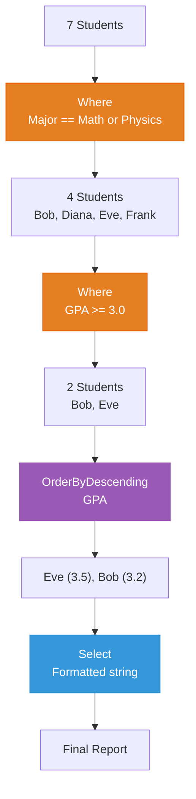

# Lecture 2: Aggregation, Element Methods, and LINQ on Objects

[← Previous: Lecture 1 – Lambda Expressions and Introduction to LINQ](./lecture-1.md) | [Back to Week 14 Overview](./README.md) | [Next: Lecture 3 – GroupBy, Advanced Chaining, and Real-World Patterns →](./lecture-3.md)

---

## Lecture Overview

| Item | Detail |
|------|--------|
| Duration | 45 minutes |
| Topics | `Count`, `Sum`, `Average`, `Min`, `Max`, `First`, `FirstOrDefault`, `Any`, `All`, LINQ on `List<T>` of custom objects |
| Preparation | Understand `Where`, `Select`, `OrderBy`, and method chaining from Lecture 1 |

---

## 1. Aggregation Methods — Summarizing Data

Aggregation methods collapse an entire collection into a **single value**. Instead of looping to calculate a sum or find the maximum, you call one method.

### The Big Five

```csharp
List<int> scores = new List<int> { 85, 92, 78, 95, 88 };

int count   = scores.Count();       // 5
int sum     = scores.Sum();         // 438
double avg  = scores.Average();     // 87.6
int min     = scores.Min();         // 78
int max     = scores.Max();         // 95
```

| Method | Returns | Description |
|--------|---------|-------------|
| `Count()` | `int` | Number of elements |
| `Sum()` | Same as element type | Total of all elements |
| `Average()` | `double` | Arithmetic mean |
| `Min()` | Same as element type | Smallest element |
| `Max()` | Same as element type | Largest element |

### With a Lambda — Aggregating a Specific Property

Each aggregation method has an overload that accepts a lambda, letting you specify *what* to aggregate:

```csharp
List<string> names = new List<string> { "Alice", "Bob", "Charlie", "Diana" };

int longest = names.Max(name => name.Length);     // 7 (Charlie)
int shortest = names.Min(name => name.Length);    // 3 (Bob)
double avgLen = names.Average(name => name.Length); // 5.0
```

This becomes essential when working with objects — you'll aggregate a *property* of each object rather than the object itself.

### Count with a Condition

`Count` can also take a lambda to count only items that match a condition:

```csharp
List<int> scores = new List<int> { 85, 92, 78, 95, 88 };

int passing = scores.Count(s => s >= 80);  // 4
int failing = scores.Count(s => s < 80);   // 1
```

This is equivalent to `.Where(s => s >= 80).Count()` but shorter.

---

## 2. Element Methods — Finding Specific Items

Element methods return a **single element** from a collection rather than a filtered list.

### `First` and `FirstOrDefault`

```csharp
List<int> numbers = new List<int> { 3, 7, 2, 9, 5 };

int first = numbers.First();                // 3 (first element)
int firstBig = numbers.First(n => n > 5);   // 7 (first matching element)
```

**But what if nothing matches?**

```csharp
// DANGEROUS — throws an exception if no match
int result = numbers.First(n => n > 100);  // InvalidOperationException!

// SAFE — returns the default value (0 for int) if no match
int result = numbers.FirstOrDefault(n => n > 100);  // 0
```

| Method | No Match Found | Use When |
|--------|---------------|----------|
| `First()` | Throws `InvalidOperationException` | You're **certain** a match exists |
| `FirstOrDefault()` | Returns default value (`0`, `null`, `false`, etc.) | A match **might not** exist |

> **Best practice:** Use `FirstOrDefault` in most cases. It's safer and you can check the result.

```csharp
List<string> names = new List<string> { "Alice", "Bob", "Charlie" };

string? found = names.FirstOrDefault(n => n.StartsWith("Z"));

if (found == null)
{
    Console.WriteLine("No name starting with Z found.");
}
else
{
    Console.WriteLine($"Found: {found}");
}
```

**Output:**
```
No name starting with Z found.
```

### `Last` and `LastOrDefault`

These work the same as `First` but return the **last** matching element:

```csharp
List<int> numbers = new List<int> { 3, 7, 2, 9, 5 };

int last = numbers.Last();                    // 5
int lastBig = numbers.LastOrDefault(n => n > 5); // 9
```

---

## 3. Boolean Methods — Asking Questions

These methods return `true` or `false` about a collection.

### `Any` — "Does at least one match?"

```csharp
List<int> scores = new List<int> { 85, 92, 78, 95, 88 };

bool hasFailure = scores.Any(s => s < 60);    // false
bool hasPerfect = scores.Any(s => s == 100);  // false
bool hasHigh = scores.Any(s => s >= 90);      // true
```

`Any()` without a lambda checks if the collection has *any elements at all*:

```csharp
List<int> empty = new List<int>();
bool hasItems = empty.Any();  // false
```

### `All` — "Do all items match?"

```csharp
List<int> scores = new List<int> { 85, 92, 78, 95, 88 };

bool allPassing = scores.All(s => s >= 60);   // true
bool allAbove90 = scores.All(s => s >= 90);   // false
```

### Practical Uses

```csharp
List<string> emails = new List<string>
{
    "alice@email.com", "bob@email.com", "charlie@email.com"
};

// Validate before processing
if (emails.All(e => e.Contains("@")))
{
    Console.WriteLine("All emails are valid.");
}

// Check if any need attention
if (emails.Any(e => e.EndsWith(".gov")))
{
    Console.WriteLine("Contains government emails — apply extra checks.");
}
```

### Summary Table

| Method | Question It Answers | Returns |
|--------|-------------------|---------|
| `Any()` | Is the collection non-empty? | `bool` |
| `Any(lambda)` | Does at least one element match? | `bool` |
| `All(lambda)` | Do ALL elements match? | `bool` |

---

## 4. LINQ on Custom Objects — Where It All Comes Together

Everything you've learned so far has used simple types — `int`, `string`. But the real power of LINQ appears when you query **lists of objects**.

### Setting Up the Example

Let's define a `Student` class and populate a list:

```csharp
class Student
{
    public string Name { get; set; }
    public int Age { get; set; }
    public double Gpa { get; set; }
    public string Major { get; set; }

    public Student(string name, int age, double gpa, string major)
    {
        Name = name;
        Age = age;
        Gpa = gpa;
        Major = major;
    }

    public override string ToString()
    {
        return $"{Name} (Age: {Age}, GPA: {Gpa:F1}, Major: {Major})";
    }
}
```

```csharp
List<Student> students = new List<Student>
{
    new Student("Alice", 20, 3.8, "Computer Science"),
    new Student("Bob", 22, 3.2, "Mathematics"),
    new Student("Charlie", 19, 3.9, "Computer Science"),
    new Student("Diana", 21, 2.8, "Physics"),
    new Student("Eve", 20, 3.5, "Mathematics"),
    new Student("Frank", 23, 2.5, "Physics"),
    new Student("Grace", 21, 3.7, "Computer Science")
};
```

### Filtering Objects

```csharp
// Students with GPA above 3.5
var honorStudents = students
    .Where(s => s.Gpa > 3.5)
    .ToList();

Console.WriteLine("Honor Students:");
foreach (var s in honorStudents)
{
    Console.WriteLine($"  {s}");
}
```

**Output:**
```
Honor Students:
  Alice (Age: 20, GPA: 3.8, Major: Computer Science)
  Charlie (Age: 19, GPA: 3.9, Major: Computer Science)
  Grace (Age: 21, GPA: 3.7, Major: Computer Science)
```

### Sorting Objects

```csharp
// All students sorted by GPA (highest first)
var ranked = students
    .OrderByDescending(s => s.Gpa)
    .ToList();

Console.WriteLine("Student Rankings:");
int rank = 1;
foreach (var s in ranked)
{
    Console.WriteLine($"  #{rank++}: {s.Name} — GPA: {s.Gpa:F1}");
}
```

**Output:**
```
Student Rankings:
  #1: Charlie — GPA: 3.9
  #2: Alice — GPA: 3.8
  #3: Grace — GPA: 3.7
  #4: Eve — GPA: 3.5
  #5: Bob — GPA: 3.2
  #6: Diana — GPA: 2.8
  #7: Frank — GPA: 2.5
```

### Extracting Properties

```csharp
// Get just the names of CS students
var csNames = students
    .Where(s => s.Major == "Computer Science")
    .Select(s => s.Name)
    .ToList();

Console.WriteLine("CS Students: " + string.Join(", ", csNames));
```

**Output:**
```
CS Students: Alice, Charlie, Grace
```

### Aggregating Object Properties

```csharp
double averageGpa = students.Average(s => s.Gpa);
double highestGpa = students.Max(s => s.Gpa);
int csCount = students.Count(s => s.Major == "Computer Science");
int youngestAge = students.Min(s => s.Age);

Console.WriteLine($"Average GPA: {averageGpa:F2}");
Console.WriteLine($"Highest GPA: {highestGpa:F1}");
Console.WriteLine($"CS Students: {csCount}");
Console.WriteLine($"Youngest Age: {youngestAge}");
```

**Output:**
```
Average GPA: 3.34
Highest GPA: 3.9
CS Students: 3
Youngest Age: 19
```

### Boolean Checks on Objects

```csharp
bool anyFailing = students.Any(s => s.Gpa < 2.0);
Console.WriteLine($"Any students failing? {anyFailing}");  // False

bool allAdults = students.All(s => s.Age >= 18);
Console.WriteLine($"All students adults? {allAdults}");  // True
```

### Finding a Specific Object

```csharp
Student? topStudent = students
    .OrderByDescending(s => s.Gpa)
    .FirstOrDefault();

if (topStudent != null)
{
    Console.WriteLine($"Top student: {topStudent.Name} with GPA {topStudent.Gpa:F1}");
}
```

**Output:**
```
Top student: Charlie with GPA 3.9
```

---

## 5. Combining Where, OrderBy, Select on Objects

Here's a realistic example that chains multiple operations:

```csharp
// Find all Math and Physics students with GPA >= 3.0,
// sorted by GPA descending, showing a formatted report

var report = students
    .Where(s => s.Major == "Mathematics" || s.Major == "Physics")
    .Where(s => s.Gpa >= 3.0)
    .OrderByDescending(s => s.Gpa)
    .Select(s => $"{s.Name,-10} | {s.Major,-15} | GPA: {s.Gpa:F1}")
    .ToList();

Console.WriteLine("STEM Report (Math & Physics, GPA ≥ 3.0):");
Console.WriteLine(new string('-', 45));
foreach (string line in report)
{
    Console.WriteLine(line);
}
Console.WriteLine(new string('-', 45));
Console.WriteLine($"Total: {report.Count} students");
```

**Output:**
```
STEM Report (Math & Physics, GPA ≥ 3.0):
---------------------------------------------
Eve        | Mathematics     | GPA: 3.5
Bob        | Mathematics     | GPA: 3.2
---------------------------------------------
Total: 2 students
```

### Diagram: Object Query Flow



---

## 6. Loop vs LINQ — Side by Side

To appreciate the difference, here's the same task done both ways:

**Task:** Find the average GPA of Computer Science students.

### Loop Approach

```csharp
double totalGpa = 0;
int csCount = 0;

foreach (Student s in students)
{
    if (s.Major == "Computer Science")
    {
        totalGpa += s.Gpa;
        csCount++;
    }
}

double averageGpa = csCount > 0 ? totalGpa / csCount : 0;
Console.WriteLine($"Average CS GPA: {averageGpa:F2}");
```

### LINQ Approach

```csharp
double averageGpa = students
    .Where(s => s.Major == "Computer Science")
    .Average(s => s.Gpa);

Console.WriteLine($"Average CS GPA: {averageGpa:F2}");
```

Both produce the same output: `Average CS GPA: 3.80`

The LINQ version is 3 lines instead of 10. More importantly, it clearly states **what** you want, not **how** to compute it.

---

## Key Takeaways

| Concept | Summary |
|---------|---------|
| **`Count()`** | Number of elements (optionally matching a condition) |
| **`Sum()`** | Total of all values |
| **`Average()`** | Arithmetic mean |
| **`Min()` / `Max()`** | Smallest / largest value |
| **`First()`** | First matching element (throws if none) |
| **`FirstOrDefault()`** | First matching element (returns default if none) |
| **`Any()`** | True if at least one element matches |
| **`All()`** | True if every element matches |
| **LINQ on objects** | Use lambdas to reference properties: `s => s.Gpa` |

---

## What's Next?

In [Lecture 3](./lecture-3.md), you'll learn `GroupBy` for categorizing data, tackle more complex real-world queries, and see how LINQ patterns connect directly to database queries you'll write in future courses.

---

[← Previous: Lecture 1 – Lambda Expressions and Introduction to LINQ](./lecture-1.md) | [Back to Week 14 Overview](./README.md) | [Next: Lecture 3 – GroupBy, Advanced Chaining, and Real-World Patterns →](./lecture-3.md)
