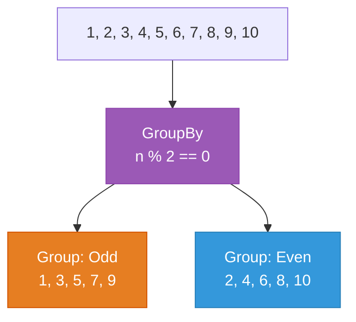

# Lecture 3: GroupBy, Advanced Chaining, and Real-World Patterns

[← Previous: Lecture 2 – Aggregation, Element Methods, and LINQ on Objects](./lecture-2.md) | [Back to Week 14 Overview](./README.md)

---

## Lecture Overview

| Item | Detail |
|------|--------|
| Duration | 45 minutes |
| Topics | `GroupBy`, `Distinct`, complex chaining, loop-to-LINQ conversions, LINQ and databases preview |
| Preparation | Understand all LINQ methods from Lectures 1 and 2 |

---

## 1. `GroupBy` — Categorizing Data

`GroupBy` splits a collection into **groups** based on a key. Each group contains all elements that share the same key value.

### Syntax

```csharp
collection.GroupBy(element => key)
```

The result is a collection of **groups**, where each group has:
- A **`Key`** property — the value items were grouped by
- The group itself is a collection of matching items (you can iterate over it)

### Example: Group Numbers by Even/Odd

```csharp
List<int> numbers = new List<int> { 1, 2, 3, 4, 5, 6, 7, 8, 9, 10 };

var groups = numbers.GroupBy(n => n % 2 == 0 ? "Even" : "Odd");

foreach (var group in groups)
{
    Console.WriteLine($"{group.Key}: {string.Join(", ", group)}");
}
```

**Output:**
```
Odd: 1, 3, 5, 7, 9
Even: 2, 4, 6, 8, 10
```

### Diagram: How GroupBy Works



### Example: Group Students by Major

Using the `Student` class from Lecture 2:

```csharp
var byMajor = students.GroupBy(s => s.Major);

foreach (var group in byMajor)
{
    Console.WriteLine($"\n{group.Key} ({group.Count()} students):");
    foreach (var student in group)
    {
        Console.WriteLine($"  {student.Name} — GPA: {student.Gpa:F1}");
    }
}
```

**Output:**
```
Computer Science (3 students):
  Alice — GPA: 3.8
  Charlie — GPA: 3.9
  Grace — GPA: 3.7

Mathematics (2 students):
  Bob — GPA: 3.2
  Eve — GPA: 3.5

Physics (2 students):
  Diana — GPA: 2.8
  Frank — GPA: 2.5
```

### Aggregating Within Groups

You can use LINQ methods *inside* each group:

```csharp
var majorStats = students.GroupBy(s => s.Major);

Console.WriteLine($"{"Major",-20} {"Count",5} {"Avg GPA",10}");
Console.WriteLine(new string('-', 37));

foreach (var group in majorStats)
{
    double avgGpa = group.Average(s => s.Gpa);
    Console.WriteLine($"{group.Key,-20} {group.Count(),5} {avgGpa,10:F2}");
}
```

**Output:**
```
Major                Count    Avg GPA
-------------------------------------
Computer Science         3       3.80
Mathematics              2       3.35
Physics                  2       2.65
```

### Chaining After GroupBy

You can sort or filter groups themselves:

```csharp
// Majors with average GPA above 3.0, sorted by average GPA descending
var topMajors = students
    .GroupBy(s => s.Major)
    .Where(g => g.Average(s => s.Gpa) > 3.0)
    .OrderByDescending(g => g.Average(s => s.Gpa))
    .ToList();

foreach (var group in topMajors)
{
    Console.WriteLine($"{group.Key}: Avg GPA = {group.Average(s => s.Gpa):F2}");
}
```

**Output:**
```
Computer Science: Avg GPA = 3.80
Mathematics: Avg GPA = 3.35
```

---

## 2. `Distinct` — Removing Duplicates

`Distinct` returns only unique elements:

```csharp
List<string> colors = new List<string>
{
    "Red", "Blue", "Red", "Green", "Blue", "Red"
};

var uniqueColors = colors.Distinct().ToList();
// Result: Red, Blue, Green
```

### Getting Distinct Values from Objects

Use `Select` first to extract the property, then `Distinct`:

```csharp
var majors = students
    .Select(s => s.Major)
    .Distinct()
    .OrderBy(m => m)
    .ToList();

Console.WriteLine("Available Majors: " + string.Join(", ", majors));
```

**Output:**
```
Available Majors: Computer Science, Mathematics, Physics
```

---

## 3. Complex Real-World Queries

Let's work through some realistic scenarios that combine multiple LINQ methods.

### Scenario 1: Product Inventory Report

```csharp
class Product
{
    public string Name { get; set; }
    public string Category { get; set; }
    public decimal Price { get; set; }
    public int Stock { get; set; }

    public Product(string name, string category, decimal price, int stock)
    {
        Name = name;
        Category = category;
        Price = price;
        Stock = stock;
    }
}
```

```csharp
List<Product> products = new List<Product>
{
    new Product("Laptop", "Electronics", 999.99m, 25),
    new Product("Mouse", "Electronics", 29.99m, 150),
    new Product("Keyboard", "Electronics", 79.99m, 80),
    new Product("Desk", "Furniture", 349.99m, 15),
    new Product("Chair", "Furniture", 249.99m, 30),
    new Product("Monitor", "Electronics", 449.99m, 40),
    new Product("Lamp", "Furniture", 59.99m, 60),
    new Product("Headphones", "Electronics", 149.99m, 65),
    new Product("Bookshelf", "Furniture", 199.99m, 20),
    new Product("Webcam", "Electronics", 89.99m, 45)
};
```

**Query 1: Category Summary**

```csharp
var categorySummary = products
    .GroupBy(p => p.Category)
    .Select(g => new
    {
        Category = g.Key,
        ProductCount = g.Count(),
        TotalValue = g.Sum(p => p.Price * p.Stock),
        AvgPrice = g.Average(p => p.Price)
    })
    .OrderByDescending(c => c.TotalValue)
    .ToList();

Console.WriteLine($"{"Category",-15} {"Products",10} {"Avg Price",12} {"Total Value",14}");
Console.WriteLine(new string('-', 53));

foreach (var cat in categorySummary)
{
    Console.WriteLine($"{cat.Category,-15} {cat.ProductCount,10} {cat.AvgPrice,12:C} {cat.TotalValue,14:C}");
}
```

**Output:**
```
Category         Products    Avg Price    Total Value
-----------------------------------------------------
Electronics             6      $299.99     $61,946.10
Furniture               4      $214.99     $16,274.10
```

> **Note:** The `new { ... }` syntax creates an **anonymous type** — an object without a named class. This is useful in LINQ when you need a temporary shape for your data. You'll see this pattern frequently.

**Query 2: Low Stock Alerts**

```csharp
var lowStock = products
    .Where(p => p.Stock < 30)
    .OrderBy(p => p.Stock)
    .Select(p => $"⚠️ {p.Name}: only {p.Stock} left (${p.Price})")
    .ToList();

Console.WriteLine("\nLow Stock Alerts:");
foreach (string alert in lowStock)
{
    Console.WriteLine($"  {alert}");
}
```

**Output:**
```
Low Stock Alerts:
  ⚠️ Desk: only 15 left ($349.99)
  ⚠️ Bookshelf: only 20 left ($199.99)
  ⚠️ Laptop: only 25 left ($999.99)
```

### Scenario 2: Grade Distribution

```csharp
List<int> grades = new List<int>
{
    95, 87, 72, 63, 91, 88, 76, 54, 98, 82,
    71, 69, 93, 85, 77, 60, 89, 94, 73, 81
};

var distribution = grades
    .GroupBy(g => g switch
    {
        >= 90 => "A",
        >= 80 => "B",
        >= 70 => "C",
        >= 60 => "D",
        _     => "F"
    })
    .OrderBy(g => g.Key)
    .ToList();

Console.WriteLine("Grade Distribution:");
Console.WriteLine(new string('-', 30));

foreach (var group in distribution)
{
    string bar = new string('█', group.Count());
    Console.WriteLine($"  {group.Key}: {bar} ({group.Count()})");
}

Console.WriteLine($"\nClass Average: {grades.Average():F1}");
Console.WriteLine($"Highest: {grades.Max()}  Lowest: {grades.Min()}");
```

**Output:**
```
Grade Distribution:
------------------------------
  A: ██████ (6)
  B: █████ (5)
  C: █████ (5)
  D: ███ (3)
  F: █ (1)

Class Average: 79.9
Highest: 98  Lowest: 54
```

---

## 4. Anonymous Types in LINQ

You saw `new { ... }` in the product example. Let's look at anonymous types more closely.

### What Are They?

Anonymous types let you create objects without defining a class first. The compiler creates the class for you behind the scenes.

```csharp
var person = new { Name = "Alice", Age = 30 };
Console.WriteLine($"{person.Name} is {person.Age}");
// Output: Alice is 30
```

### Why Use Them with LINQ?

When `Select` needs to return multiple properties but you don't have (or need) a class for the result:

```csharp
var summary = students
    .Select(s => new { s.Name, s.Major, Honor = s.Gpa >= 3.5 })
    .ToList();

foreach (var item in summary)
{
    string status = item.Honor ? "⭐ Honor" : "  Regular";
    Console.WriteLine($"{status} | {item.Name,-10} | {item.Major}");
}
```

**Output:**
```
⭐ Honor | Alice      | Computer Science
  Regular | Bob        | Mathematics
⭐ Honor | Charlie    | Computer Science
  Regular | Diana      | Physics
⭐ Honor | Eve        | Mathematics
  Regular | Frank      | Physics
⭐ Honor | Grace      | Computer Science
```

### Important Limitations

- Anonymous types are **read-only** — you can't change their properties
- They only exist within the method they're created in — you can't return them from a method
- Use `var` to declare them since you can't write out the type name

> **When to use anonymous types vs a real class:** If you only need the data temporarily within a single method (like formatting a report), anonymous types are fine. If you need to pass the data to other methods or store it long-term, create a proper class.

---

## 5. Converting Loop Patterns to LINQ

Here's a reference for the most common loop-to-LINQ conversions:

### Pattern 1: Filter and Collect

```csharp
// Loop
List<Student> result = new List<Student>();
foreach (var s in students)
{
    if (s.Gpa > 3.0)
        result.Add(s);
}

// LINQ
var result = students.Where(s => s.Gpa > 3.0).ToList();
```

### Pattern 2: Transform Each Item

```csharp
// Loop
List<string> names = new List<string>();
foreach (var s in students)
{
    names.Add(s.Name.ToUpper());
}

// LINQ
var names = students.Select(s => s.Name.ToUpper()).ToList();
```

### Pattern 3: Find One Item

```csharp
// Loop
Student? found = null;
foreach (var s in students)
{
    if (s.Name == "Alice")
    {
        found = s;
        break;
    }
}

// LINQ
var found = students.FirstOrDefault(s => s.Name == "Alice");
```

### Pattern 4: Check a Condition

```csharp
// Loop
bool hasHonor = false;
foreach (var s in students)
{
    if (s.Gpa >= 3.5)
    {
        hasHonor = true;
        break;
    }
}

// LINQ
bool hasHonor = students.Any(s => s.Gpa >= 3.5);
```

### Pattern 5: Accumulate a Value

```csharp
// Loop
double total = 0;
foreach (var s in students)
{
    total += s.Gpa;
}
double average = total / students.Count;

// LINQ
double average = students.Average(s => s.Gpa);
```

---

## 6. LINQ Quick Reference

Here's a complete reference of all LINQ methods covered this week:

| Method | Purpose | Returns | Example |
|--------|---------|---------|---------|
| `Where` | Filter by condition | `IEnumerable<T>` | `.Where(s => s.Age > 18)` |
| `Select` | Transform each element | `IEnumerable<TResult>` | `.Select(s => s.Name)` |
| `OrderBy` | Sort ascending | `IOrderedEnumerable<T>` | `.OrderBy(s => s.Name)` |
| `OrderByDescending` | Sort descending | `IOrderedEnumerable<T>` | `.OrderByDescending(s => s.Gpa)` |
| `ThenBy` | Secondary sort | `IOrderedEnumerable<T>` | `.OrderBy(s => s.Major).ThenBy(s => s.Name)` |
| `First` | First match (throws if none) | `T` | `.First(s => s.Gpa > 3.5)` |
| `FirstOrDefault` | First match (default if none) | `T?` | `.FirstOrDefault(s => s.Gpa > 3.5)` |
| `Last` / `LastOrDefault` | Last match | `T` / `T?` | `.Last(s => s.Age > 20)` |
| `Any` | At least one matches? | `bool` | `.Any(s => s.Gpa < 2.0)` |
| `All` | Every element matches? | `bool` | `.All(s => s.Age >= 18)` |
| `Count` | Count (optionally filtered) | `int` | `.Count(s => s.Major == "CS")` |
| `Sum` | Total of values | numeric | `.Sum(s => s.Gpa)` |
| `Average` | Mean of values | `double` | `.Average(s => s.Gpa)` |
| `Min` / `Max` | Smallest / largest | `T` | `.Max(s => s.Gpa)` |
| `GroupBy` | Categorize by key | `IEnumerable<IGrouping<TKey, T>>` | `.GroupBy(s => s.Major)` |
| `Distinct` | Remove duplicates | `IEnumerable<T>` | `.Select(s => s.Major).Distinct()` |
| `ToList` | Convert to `List<T>` | `List<T>` | `.Where(...).ToList()` |

---

## 7. Looking Ahead: LINQ and Databases

Here's why LINQ matters beyond this course. When you reach the **Database** and **Web App** courses, you'll use **Entity Framework** to query databases. The syntax is *exactly the same LINQ* you learned this week:

```csharp
// LINQ on a List (what you learned this week)
var csStudents = students
    .Where(s => s.Major == "Computer Science")
    .OrderBy(s => s.Name)
    .ToList();

// LINQ on a Database (what you'll learn in future courses)
var csStudents = dbContext.Students
    .Where(s => s.Major == "Computer Science")
    .OrderBy(s => s.Name)
    .ToList();
```

The **only difference** is the data source — a `List` in memory vs a database table. The query syntax is identical. Everything you practiced this week transfers directly.

This is one of the most powerful features of C#: you learn one query language and use it everywhere — in-memory collections, databases, XML, JSON, and more.

---

## Key Takeaways

| Concept | Summary |
|---------|---------|
| **`GroupBy`** | Splits a collection into groups by a key value |
| **Group properties** | Each group has a `.Key` and contains matching items |
| **Aggregating groups** | Use `.Count()`, `.Average()`, etc. inside each group |
| **`Distinct`** | Removes duplicate elements |
| **Anonymous types** | `new { Name, Age }` — quick data shapes without a class |
| **Loop → LINQ** | Most loop patterns have a one-line LINQ equivalent |
| **LINQ → Database** | Same syntax works with Entity Framework in future courses |

---

## What's Next?

Next week in [Week 15](../week-15/README.md), you'll bring everything together — classes, inheritance, interfaces, collections, LINQ, and exception handling — into a comprehensive console application. You'll also preview how these skills connect to MVC and Entity Framework in the courses ahead.

---

[← Previous: Lecture 2 – Aggregation, Element Methods, and LINQ on Objects](./lecture-2.md) | [Back to Week 14 Overview](./README.md)
