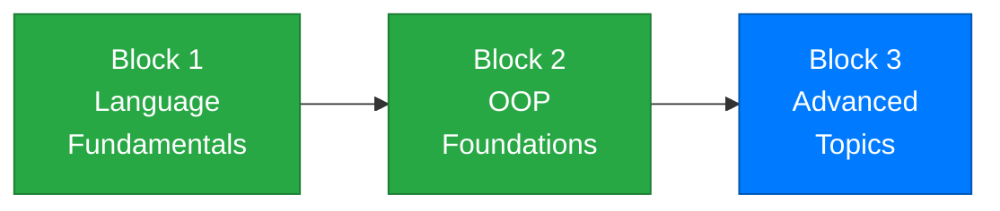

# Week 15 – Putting It All Together and Looking Ahead

[← Back to Course Home](../../README.md) | [← Previous: Week 14 – LINQ and Lambda Expressions](../week-14/README.md)

---

## 📋 Overview

This is the final week of the course — and it's designed to bring everything full circle. You've spent 14 weeks building up a powerful toolkit: variables, control flow, methods, arrays, classes, inheritance, interfaces, exception handling, generics, and LINQ. This week, you'll learn two final topics — **static members** and a conceptual introduction to **async/await** — and then use *everything* together in a comprehensive integration exercise.

Think of it this way: each previous week gave you a tool. This week, you build something real with the full toolbox. And at the end, we'll look ahead at how these skills connect directly to the courses that follow — databases, system design, and web application development.

---

## 🎯 Learning Objectives

By the end of this week, you will be able to:

1. Define and use **static fields**, **static methods**, and **static classes**
2. Know when static members are appropriate vs instance members
3. Understand the **concept** of asynchronous programming and recognize `async`/`await` syntax
4. Build a structured console application that integrates **classes, inheritance, interfaces, collections, LINQ, and exception handling**
5. Explain how this course's concepts connect to **MVC**, **Entity Framework**, and **web application development**

---

## 📚 Materials

| # | Material | Topic |
|---|----------|-------|
| 1 | [Lecture 1 – Static Members and Static Classes](./lecture-1.md) | Static fields, static methods, static classes, utility/helper patterns |
| 2 | [Lecture 2 – Introduction to Async/Await and Course Review](./lecture-2.md) | Async concepts, async/await syntax, review of all course topics |
| 3 | [Lecture 3 – Integration: Building a Complete Application](./lecture-3.md) | Building a full application combining all course concepts |
| 4 | [Exercises](./exercises.md) | Practice problems for each lecture |
| 5 | [Assignment](./assignment.md) | 📝 Course Library Manager — final assignment |

---

## 🗺️ Where Are We?



```
✅ Week 1  – Getting Started          ✅ Week 9  – Inheritance
✅ Week 2  – Variables & Types         ✅ Week 10 – Polymorphism
✅ Week 3  – Conditionals              ✅ Week 11 – Interfaces & Composition
✅ Week 4  – Loops                     ✅ Week 12 – Exception Handling
✅ Week 5  – Methods                   ✅ Week 13 – Generics, Enums, Nullables
✅ Week 6  – Arrays & Collections      ✅ Week 14 – LINQ & Lambdas
✅ Week 7  – Classes & Objects         👉 Week 15 – Integration ← YOU ARE HERE
✅ Week 8  – Encapsulation
```

---

## 🔗 Prerequisites

Before starting this week, make sure you're comfortable with:

- **All previous weeks** — this week integrates the entire course
- **Classes, inheritance, and interfaces** (Weeks 7–11)
- **Exception handling** (Week 12)
- **Generics and enums** (Week 13)
- **LINQ and lambda expressions** (Week 14)

---

## ✅ Week Checklist

- [ ] Complete Lecture 1 — understand static members and when to use them
- [ ] Complete Lecture 2 — grasp the concept of async/await; review course topics
- [ ] Complete Lecture 3 — follow the integration walkthrough building a complete app
- [ ] Work through the practice exercises
- [ ] Complete the **Course Library Manager** final assignment

---

[← Week 14: LINQ & Lambda Expressions](../week-14/README.md) | [Capstone Project →](../../capstone/README.md)
