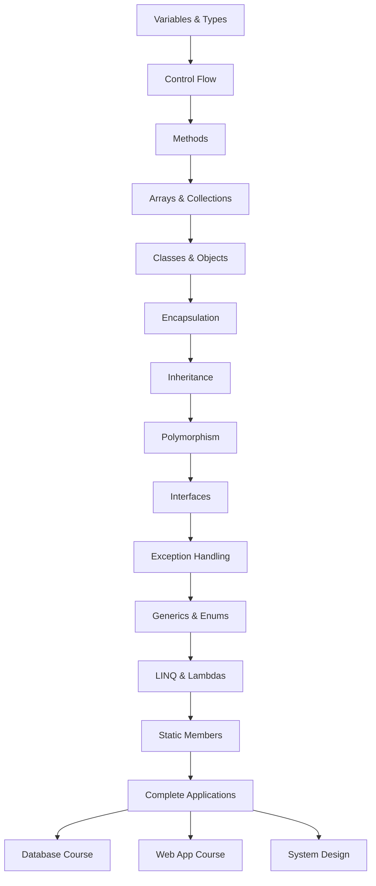

# Lecture 2: Introduction to Async/Await and Course Review

[← Previous: Lecture 1 – Static Members and Static Classes](./lecture-1.md) | [Back to Week 15 Overview](./README.md) | [Next: Lecture 3 – Integration: Building a Complete Application →](./lecture-3.md)

---

## Lecture Overview

| Item | Detail |
|------|--------|
| Duration | 45 minutes |
| Topics | Async/await concept and syntax (conceptual), comprehensive course review |
| Preparation | All previous weeks; Lecture 1 on static members |

---

## Part 1: Introduction to Async/Await (Conceptual)

> **Important note:** This section is a **conceptual introduction** only. You won't be writing complex async applications yet. The goal is to understand *what* async programming is, *why* it exists, and *recognize the syntax* — so it's not completely new when you encounter it in web development courses.

---

## 1. The Problem: Waiting Is Wasteful

Imagine you're at a restaurant. You order food, and while the kitchen prepares it, you could:

- **Option A:** Stand at the counter staring at the kitchen door until your food is ready (doing nothing else)
- **Option B:** Sit down, check your phone, read the menu, talk to friends — and the waiter brings your food when it's ready

Option A is how **synchronous** programs work. Option B is how **asynchronous** programs work.

In programming, many operations take time:
- Reading a file from disk
- Downloading data from the internet
- Querying a database
- Calling an external API

In a synchronous program, your code **stops and waits** for each operation to finish before moving on. In a web application, this means a user clicking a button might freeze the entire page. Async programming lets your program **start** a slow operation, **do other work** while waiting, and **come back** when the result is ready.

---

## 2. Synchronous vs Asynchronous — A Visual Comparison

### Synchronous (Blocking)

```
Start → [Download file........] → [Process file] → [Show result] → Done
         (program waits here)
```

The program does **nothing** while the file downloads. If this is a web server, other users must wait too.

### Asynchronous (Non-Blocking)

```
Start → [Start download] → [Do other work...] → [Download complete!] → [Process file] → Done
```

The program starts the download, handles other tasks, and comes back when the download finishes.

---

## 3. The `async` and `await` Keywords

C# uses two keywords to make asynchronous code almost as easy to read as synchronous code:

- **`async`** — marks a method as asynchronous
- **`await`** — pauses the method until an asynchronous operation completes

### Synchronous Version

```csharp
// This blocks — the program waits while reading the file
string content = File.ReadAllText("data.txt");
Console.WriteLine(content);
```

### Asynchronous Version

```csharp
// This doesn't block — the program can do other work while reading
string content = await File.ReadAllTextAsync("data.txt");
Console.WriteLine(content);
```

The logic looks almost identical! The `await` keyword is the magic — it says "start this operation, and come back when it's done."

---

## 4. The `Task` Return Type

Async methods return a `Task` (or `Task<T>` if they return a value). Think of a `Task` as a **promise** — "I'll give you the result later."

```csharp
// Synchronous — returns the result immediately
public string GetGreeting(string name)
{
    return $"Hello, {name}!";
}

// Asynchronous — returns a Task that will eventually contain the result
public async Task<string> GetGreetingAsync(string name)
{
    await Task.Delay(1000);  // Simulate a slow operation (1 second)
    return $"Hello, {name}!";
}
```

| Synchronous | Asynchronous |
|------------|--------------|
| `string` return type | `Task<string>` return type |
| Returns value directly | Returns a `Task` that resolves to a value |
| Caller waits | Caller can do other work |

### Naming Convention

By convention, async methods end with **`Async`**: `ReadAllTextAsync`, `GetGreetingAsync`, `SaveDataAsync`. This makes it clear the method is asynchronous.

---

## 5. A Simple Complete Example

```csharp
using System;
using System.Threading.Tasks;

class Program
{
    static async Task Main(string[] args)
    {
        Console.WriteLine("Starting...");
        
        string message = await GetMessageAsync();
        
        Console.WriteLine(message);
        Console.WriteLine("Done!");
    }

    static async Task<string> GetMessageAsync()
    {
        Console.WriteLine("Fetching message (please wait)...");
        await Task.Delay(2000);  // Simulate a 2-second network call
        return "Hello from the async world!";
    }
}
```

**Output:**
```
Starting...
Fetching message (please wait)...
Hello from the async world!
Done!
```

> **Note:** `Task.Delay()` is used here to simulate a slow operation. In real applications, you'd `await` actual I/O operations like file reads, HTTP requests, or database queries.

---

## 6. Why This Matters for Web Development

In your upcoming Web App course, async/await will be everywhere:

```csharp
// In an MVC controller (you'll learn this later)
public async Task<IActionResult> GetStudents()
{
    var students = await _database.Students.ToListAsync();
    return View(students);
}
```

This pattern lets a web server handle **thousands of requests** without blocking. If each request waited synchronously for its database query, the server would quickly run out of capacity.

> **For now:** You don't need to master async/await. Just recognize the pattern: `async` on the method, `Task` or `Task<T>` as the return type, and `await` before slow operations. When you see it in the Web App course, it won't be a surprise.

---

## Part 2: Course Review — Your Complete Toolkit

Let's review everything you've learned across 15 weeks. This is your programming toolkit — every concept builds on the ones before it.

---

## 7. Block 1 Recap: Language Fundamentals (Weeks 1–6)

### Variables and Data Types (Weeks 1–2)

The building blocks of every program: storing data in named containers.

```csharp
string name = "Alice";
int age = 20;
double gpa = 3.8;
bool isEnrolled = true;

Console.WriteLine($"{name} is {age} years old with a GPA of {gpa}");
```

**Key concepts:** `int`, `double`, `string`, `bool`, `decimal`, type conversion, `TryParse`, string interpolation.

### Control Flow (Weeks 3–4)

Making decisions and repeating actions.

```csharp
// Decisions (Week 3)
if (gpa >= 3.5)
    Console.WriteLine("Dean's List!");
else if (gpa >= 2.0)
    Console.WriteLine("Good standing");
else
    Console.WriteLine("Academic probation");

// Loops (Week 4)
for (int i = 1; i <= 5; i++)
    Console.WriteLine($"Week {i}");
```

**Key concepts:** `if`/`else if`/`else`, `switch`, `for`, `while`, `do-while`, `foreach`, `break`, `continue`.

### Methods (Week 5)

Breaking code into reusable, named pieces.

```csharp
static double CalculateAverage(double[] scores)
{
    double sum = 0;
    foreach (double score in scores)
        sum += score;
    return sum / scores.Length;
}
```

**Key concepts:** Parameters, return types, `void`, method overloading, the call stack.

### Arrays and Collections (Week 6)

Storing groups of related data.

```csharp
int[] scores = { 85, 92, 78, 95, 88 };
List<string> names = new List<string> { "Alice", "Bob", "Charlie" };
names.Add("Diana");
```

**Key concepts:** Array indexing, `for`/`foreach` iteration, `List<T>`, `Add`, `Remove`, `Count`, arrays vs lists.

---

## 8. Block 2 Recap: OOP Foundations (Weeks 7–11)

### Classes and Objects (Weeks 7–8)

Bundling data and behavior together.

```csharp
public class Student
{
    public string Name { get; set; }
    public double Gpa { get; private set; }

    public Student(string name, double gpa)
    {
        Name = name;
        Gpa = gpa > 4.0 ? 4.0 : gpa;  // Validation in constructor
    }

    public override string ToString() => $"{Name} (GPA: {Gpa:F1})";
}
```

**Key concepts:** Fields, properties (get/set), constructors, encapsulation, access modifiers (`public`, `private`, `protected`), `ToString()`.

### Inheritance (Week 9)

Creating specialized versions of existing classes.

```csharp
public class Person
{
    public string Name { get; set; }
    public Person(string name) { Name = name; }
    public virtual string GetRole() => "Person";
}

public class Student : Person
{
    public double Gpa { get; set; }
    public Student(string name, double gpa) : base(name) { Gpa = gpa; }
    public override string GetRole() => "Student";
}
```

**Key concepts:** Base/derived classes, `virtual`/`override`, `base()`, `protected`, "is-a" relationships.

### Polymorphism and Abstract Classes (Week 10)

Writing code that works with base types but executes derived behavior.

```csharp
public abstract class Shape
{
    public abstract double Area();
    public void PrintArea() => Console.WriteLine($"Area: {Area():F2}");
}

public class Circle : Shape
{
    public double Radius { get; set; }
    public Circle(double radius) { Radius = radius; }
    public override double Area() => Math.PI * Radius * Radius;
}
```

**Key concepts:** `abstract` classes/methods, polymorphism, `is`/`as` casting.

### Interfaces (Week 11)

Defining contracts that classes must follow.

```csharp
public interface IPrintable
{
    string ToFormattedString();
}

public interface ISaveable
{
    void Save();
}

public class Report : IPrintable, ISaveable
{
    public string Title { get; set; }
    public string ToFormattedString() => $"=== {Title} ===";
    public void Save() => Console.WriteLine($"Saving {Title}...");
}
```

**Key concepts:** Interface definition, implementation, multiple interfaces, "can-do" vs "is-a", composition over inheritance.

---

## 9. Block 3 Recap: Advanced Topics (Weeks 12–15)

### Exception Handling (Week 12)

Writing code that handles errors gracefully.

```csharp
try
{
    int result = Divide(10, 0);
}
catch (DivideByZeroException ex)
{
    Console.WriteLine($"Error: {ex.Message}");
}
catch (Exception ex)
{
    Console.WriteLine($"Unexpected error: {ex.Message}");
}
finally
{
    Console.WriteLine("Operation complete.");
}
```

**Key concepts:** `try`/`catch`/`finally`, specific vs general exceptions, `throw`, custom exceptions, validation vs exception handling.

### Generics, Enums, and Nullables (Week 13)

Type-safe flexibility and special value types.

```csharp
// Generics
Dictionary<string, List<int>> studentScores = new();

// Enums
public enum Priority { Low, Medium, High, Critical }

// Nullables
int? optionalValue = null;
int result = optionalValue ?? 0;  // Use 0 if null
```

**Key concepts:** `List<T>`, `Dictionary<TKey, TValue>`, generic classes/methods, `enum`, nullable types (`?`), null-coalescing (`??`).

### LINQ and Lambdas (Week 14)

Querying and transforming collections expressively.

```csharp
List<Student> students = GetStudents();

var honors = students
    .Where(s => s.Gpa >= 3.5)
    .OrderByDescending(s => s.Gpa)
    .Select(s => new { s.Name, s.Gpa })
    .ToList();
```

**Key concepts:** Lambda syntax (`=>`), `Where`, `Select`, `OrderBy`, `FirstOrDefault`, `Any`, `All`, `Count`, `Sum`, `Average`, `GroupBy`, chaining.

### Static Members (Week 15 — This Week)

Shared state and utility classes.

**Key concepts:** `static` fields, methods, classes; instance vs static access rules; utility/helper patterns.

---

## 10. How It All Connects — The Big Picture

Here's how these concepts work together in a real application:



Every concept builds on what came before. In Lecture 3, you'll see all of these working together in a single application.

---

## Summary

| Topic | What You Learned |
|-------|-----------------|
| Async/Await | Conceptual understanding of non-blocking operations; `async`, `await`, `Task<T>` syntax |
| Block 1 | Variables, types, control flow, methods, arrays, lists |
| Block 2 | Classes, encapsulation, inheritance, polymorphism, interfaces |
| Block 3 | Exceptions, generics, enums, LINQ, lambdas, static members |

**What's next:** In Lecture 3, we'll build a complete console application that integrates all of these concepts — and then discuss how they connect to the courses ahead.

---

[← Previous: Lecture 1 – Static Members and Static Classes](./lecture-1.md) | [Back to Week 15 Overview](./README.md) | [Next: Lecture 3 – Integration: Building a Complete Application →](./lecture-3.md)
